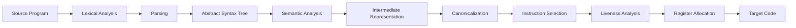

# 00 复习路线与课程覆盖

## 覆盖策略

本资料采用课程优先版。

| 优先级 | 范围 | 处理方式 |
|---|---|---|
| A | 课件已有的 `ch1-ch14` | 详细讲解、例题、练习、术语表 |
| A | `ch18 Loop Optimizations` | `ch1` 教学计划列出，虽然当前没有课件，按教材补齐 |
| B | `ch12 Putting It All Together` | 没有单独课件，但用于串联完整编译器，必须复习 |
| C | `ch15-ch17`、`ch19-ch21` | 未在教学计划主列表中出现，作为拓展速读 |

一句话：主线是“源程序 -> Token -> AST -> 类型正确的 AST -> IR -> 规范化 IR -> 汇编 -> 寄存器分配 -> 运行时支持 -> 优化”。

## 建议学习顺序

### 第一轮：建立主线

按 `01 -> 15` 顺序快速读一遍。不要一开始就陷入 LR 表或寄存器分配细节，先知道每个阶段输入是什么、输出是什么、为什么需要下一阶段。

### 第二轮：攻克手算题

重点做这些：

- 词法分析：正则表达式、NFA、DFA、DFA 最小化。
- 语法分析：FIRST/FOLLOW、LL(1) 表、LR(0) 项集、SLR 表、LR(1)/LALR 合并。
- 语义分析：符号表环境变化、类型检查。
- 后端：活跃变量分析表、干涉图、图着色寄存器分配。
- 运行时：GC 堆图模拟、对象布局。
- 优化：支配树、自然循环、循环不变式外提、强度削弱。

### 第三轮：英文术语反查

每章最后都有术语表。考前不要只看中文标题，应该能把题目里的英文转成操作：

- `nullable`：能推出空串。
- `lookahead`：向前看一个输入符号。
- `closure`：项集闭包或 epsilon 闭包，注意上下文。
- `interference graph`：两个临时变量同时活跃时连边。
- `dominator`：所有从入口到该点的路径都必须经过的点。

## 考试题型优先级

| 题型 | 复习优先级 | 说明 |
|---|---:|---|
| 手算自动机/分析表 | 高 | 最容易考步骤，错一处会连锁 |
| 概念辨析 | 高 | 英文题常问定义、区别、优缺点 |
| 算法模拟 | 高 | LR、liveness、register allocation、GC、loop optimization |
| 小段程序翻译 | 中 | AST、IR、栈帧、类型检查 |
| 证明题 | 中低 | 重点理解核心不变量，不追求形式化细节 |
| 工具使用细节 | 中低 | Lex/Yacc 要懂结构和冲突解决，不必背所有语法 |

## 每章学习模板

学习每章时按下面顺序：

1. 先看“本章解决什么问题”。
2. 再看“核心概念”。
3. 手抄一遍算法模板。
4. 做例题，不看答案复现步骤。
5. 背术语中英对照。

## 术语中英对照

| English | 中文 | 复习提示 |
|---|---|---|
| compiler | 编译器 | 把源程序翻译为语义等价的目标程序 |
| source program | 源程序 | 编译器输入 |
| target program | 目标程序 | 编译器输出 |
| front end | 前端 | 词法、语法、语义分析 |
| middle end | 中端 | 基于 IR 的机器无关优化 |
| back end | 后端 | 指令选择、寄存器分配、目标代码生成 |
| token | 词法记号 | 词法分析输出的类别 |
| abstract syntax tree, AST | 抽象语法树 | 语法分析之后的结构化表示 |
| intermediate representation, IR | 中间表示 | 连接前端和后端 |
| runtime system | 运行时系统 | 栈、堆、GC、调用约定等支持 |

