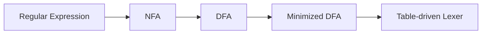

# 02 词法分析：RE、NFA、DFA、Lex

## 本章解决什么问题

词法分析把字符流切分为 Token 流。它回答两个问题：

1. 从哪里切开字符？
2. 每一段字符属于什么 Token？

例如：

```c
if (i == j) print("equal");
```

会被切成类似：

```text
IF LPAREN ID(i) EQ ID(j) RPAREN ID(print) LPAREN STRING("equal") RPAREN SEMI
```

## Token、Lexeme、Pattern

| 概念 | 解释 | 例子 |
|---|---|---|
| Token | 词法类别 | `ID`、`NUM`、`IF` |
| Lexeme | 源程序中实际出现的字符串 | `count`、`123`、`if` |
| Pattern | 描述一类 Lexeme 的规则 | `[A-Za-z][A-Za-z0-9]*` |

考试常见陷阱：`if` 是 `IF` 的 lexeme，也可能匹配 `ID` 的 pattern。Lex/Flex 通常用“最长匹配；若一样长，前面的规则优先”解决冲突。

## 形式语言基础

- 字母表：符号的有限集合。
- 串：符号的有限序列。
- 空串：长度为 0 的串，记作 `epsilon`。
- 语言：某个字母表上的串集合。

常用语言运算：

| 运算 | 含义 |
|---|---|
| `L1 L2` | 连接 |
| `L1 | L2` | 并 |
| `L*` | Kleene 闭包，重复 0 次或多次 |
| `L+` | 重复 1 次或多次 |
| `L?` | 可选，0 次或 1 次 |

## 正则表达式

正则表达式用来描述 Token 的 pattern。常见优先级是：闭包高于连接，连接高于并。

例子：

```text
letter = [A-Za-z]
digit  = [0-9]
id     = letter (letter | digit)*
int    = digit+
```

## 有穷自动机

词法分析器最终常用 DFA 执行。关系如下：



### NFA

NFA 可以有 epsilon 边，也可以对同一输入有多个后继。它容易从正则表达式构造。

### DFA

DFA 对每个状态和每个输入字符最多只有一个后继。它适合执行，因为扫描时不需要猜。

## RE 到 NFA：Thompson 构造直觉

不必死记每张图，记住三个组合：

- 并：新起点 epsilon 到两个分支，两个分支再 epsilon 到新终点。
- 连接：前一个 NFA 的终点接到后一个 NFA 的起点。
- 闭包：允许跳过、重复、退出。

## NFA 到 DFA：子集构造

DFA 的一个状态是 NFA 状态集合。

算法模板：

```text
start = epsilon-closure({nfa_start})
worklist = [start]
while worklist not empty:
    T = pop(worklist)
    for each input symbol a:
        U = epsilon-closure(move(T, a))
        add transition T --a--> U
        if U is new:
            add U to worklist
```

终态规则：如果某个 DFA 状态集合包含任一 NFA 终态，则这个 DFA 状态是终态。

## DFA 最小化

目标：把等价状态合并。两个状态等价，表示从它们出发，对任何后续输入的接受/拒绝结果都一样。

常用划分法：

1. 初始划分：终态一组，非终态一组。
2. 如果同一组内的状态在某个输入上跳到不同组，就继续拆分。
3. 重复直到不能拆。
4. 每组变成最小 DFA 的一个状态。

## Lex/Flex 规则

典型结构：

```lex
%{
/* C declarations */
%}

DIGIT [0-9]
ID    [A-Za-z][A-Za-z0-9]*

%%
"if"        { return IF; }
{ID}        { return ID; }
{DIGIT}+    { return NUM; }
[ \t\n]+    { /* skip whitespace */ }
.           { return ERROR; }
%%
```

冲突解决：

1. 选能匹配最长 lexeme 的规则。
2. 长度相同，选写在前面的规则。

所以关键字规则要放在普通标识符规则前。

## 例题：最长匹配

规则：

```text
"if"      -> IF
[a-z]+    -> ID
"=="      -> EQ
"="       -> ASSIGN
```

输入：

```text
ifx==if
```

扫描结果：

```text
ID(ifx) EQ IF
```

`ifx` 虽然前两个字符能匹配 `IF`，但 `[a-z]+` 匹配更长，所以返回 `ID(ifx)`。

## 常见误区

- `epsilon` 不是空集。空串是一个串，空集是不含任何串的集合。
- NFA 的“非确定”不是随机，而是定义上允许多个选择。
- 子集构造里的 `closure` 必须包括 epsilon 可达状态。
- DFA 最小化不能只看当前是否终态，还要看未来所有输入行为。
- Lex 不是先匹配第一条规则，而是先最长匹配。

## 练习

1. 写出标识符、十进制整数、浮点数、单行注释的正则表达式。
2. 对正则表达式 `(a|b)*abb` 构造一个 NFA，再用子集构造得到 DFA。
3. 给定输入 `elsewhere else = ==`，说明关键字和 ID 的匹配结果。
4. 对一个 5 状态 DFA 进行最小化：先分终态/非终态，再按输入拆分。

## 术语中英对照

| English | 中文 | 考试提示 |
|---|---|---|
| lexical analysis | 词法分析 | character stream -> token stream |
| token | 词法记号 | 类别，如 `ID` |
| lexeme | 词素 | 实际字符串，如 `count` |
| pattern | 模式 | 描述 lexeme 集合 |
| alphabet | 字母表 | 符号集合 |
| string | 串 | 符号序列 |
| empty string, epsilon | 空串 | 长度为 0 |
| regular expression, RE | 正则表达式 | 描述正则语言 |
| finite automaton, FA | 有穷自动机 | 识别正则语言 |
| nondeterministic finite automaton, NFA | 非确定有穷自动机 | 可有 epsilon 边/多个后继 |
| deterministic finite automaton, DFA | 确定有穷自动机 | 每状态每输入唯一后继 |
| epsilon-closure | epsilon 闭包 | 只走 epsilon 能到达的状态集合 |
| subset construction | 子集构造法 | NFA -> DFA |
| DFA minimization | DFA 最小化 | 合并等价状态 |
| longest match | 最长匹配 | Lex 冲突解决第一原则 |
| rule priority | 规则优先级 | 同长度时前面的规则优先 |

