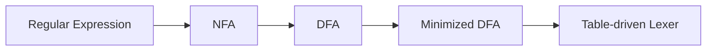

# 02 词法分析：RE、NFA、DFA、Lex

## 本章解决什么问题

词法分析把字符流切分为 Token 流。它回答两个问题：

1. 从哪里切开字符？
2. 每一段字符属于什么 Token？

例如：

```c
if (i == j) print("equal");
```

会被切成类似：

```text
IF LPAREN ID(i) EQ ID(j) RPAREN ID(print) LPAREN STRING("equal") RPAREN SEMI
```

词法分析是编译器第一个真正“看源代码字符”的阶段。它不关心表达式优先级、变量有没有声明、类型是否匹配；它只关心字符如何分组。换句话说，它把原始字符串变成更容易被语法分析器处理的离散符号。

你可以把 lexer 想成一个带状态的扫描器：

```text
当前状态 + 当前字符 -> 下一个状态
```

如果走到某个接受状态，就说明刚读过的一段字符可以形成一个 token。真正的 lexer 还要记住“目前见过的最长合法 token”，因为输入 `if8` 时应该得到一个 `ID(if8)`，而不是 `IF` 后面跟 `NUM(8)`。

## Token、Lexeme、Pattern

| 概念 | 解释 | 例子 |
|---|---|---|
| Token | 词法类别 | `ID`、`NUM`、`IF` |
| Lexeme | 源程序中实际出现的字符串 | `count`、`123`、`if` |
| Pattern | 描述一类 Lexeme 的规则 | `[A-Za-z][A-Za-z0-9]*` |

考试常见陷阱：`if` 是 `IF` 的 lexeme，也可能匹配 `ID` 的 pattern。Lex/Flex 通常用“最长匹配；若一样长，前面的规则优先”解决冲突。

三者的关系可以这样记：

```text
pattern 描述一类字符串
lexeme 是源程序里实际出现的字符串
token 是 lexer 交给 parser 的类别
```

例如规则：

```text
ID  = [A-Za-z_][A-Za-z0-9_]*
NUM = [0-9]+
IF  = "if"
```

输入 `if count 123` 的结果可能是：

```text
IF("if") ID("count") NUM("123")
```

很多教材会省略括号里的 lexeme，只写 `IF ID NUM`。但实现编译器时，`ID` 和 `NUM` 往往必须带属性值：`ID` 要告诉后续阶段名字是什么，`NUM` 要告诉后续阶段数值是多少。

## 词法分析不做什么

零基础最容易把几个阶段混在一起。下面这些事情不属于词法分析：

| 问题 | 属于哪个阶段 |
|---|---|
| `x + * y` 结构不合法 | 语法分析 |
| `x` 没有声明 | 语义分析 |
| `x + "abc"` 类型不匹配 | 语义分析 |
| `a + b * c` 中 `*` 比 `+` 优先 | 语法分析 |
| 变量放寄存器还是栈 | 后端/寄存器分配 |

词法分析最多只能说：“我识别到了 `ID(x) PLUS TIMES ID(y)` 这些 token。”这些 token 能不能组成合法句子，是下一章开始的任务。

## 形式语言基础

- 字母表：符号的有限集合。
- 串：符号的有限序列。
- 空串：长度为 0 的串，记作 `epsilon`。
- 语言：某个字母表上的串集合。

形式语言的目的不是把概念变抽象，而是让“哪些字符串合法”可以被精确描述。

举例：

```text
Σ = {a, b}
```

那么：

- `a`、`ab`、`bba` 都是 Σ 上的串。
- `epsilon` 也是 Σ 上的串，因为空串不包含非法符号。
- `{a, ab, bba}` 是一个有限语言。
- `{ 所有由 a 和 b 组成且以 abb 结尾的串 }` 是一个无限语言。

考试里 `epsilon` 和空集经常混淆：

| 写法 | 含义 |
|---|---|
| `epsilon` | 空串，是一个长度为 0 的字符串 |
| `{epsilon}` | 只包含空串的语言 |
| `empty set` 或 `∅` | 空语言，不包含任何字符串 |

所以 `epsilon in L` 与 `L = empty set` 完全不是一回事。

常用语言运算：

| 运算 | 含义 |
|---|---|
| `L1 L2` | 连接 |
| `L1 | L2` | 并 |
| `L*` | Kleene 闭包，重复 0 次或多次 |
| `L+` | 重复 1 次或多次 |
| `L?` | 可选，0 次或 1 次 |

## 正则表达式

正则表达式用来描述 Token 的 pattern。常见优先级是：闭包高于连接，连接高于并。

例子：

```text
letter = [A-Za-z]
digit  = [0-9]
id     = letter (letter | digit)*
int    = digit+
```

正则表达式的核心构造只有五个：

| 构造 | 语言含义 | 例子 |
|---|---|---|
| `a` | 只包含一个字符 `a` 的语言 | `L(a) = {"a"}` |
| `epsilon` | 只包含空串的语言 | `L(epsilon) = {epsilon}` |
| `r | s` | 并集 | `a|b` 匹配 `"a"` 或 `"b"` |
| `rs` | 连接 | `ab` 匹配 `"ab"` |
| `r*` | Kleene 闭包，重复 0 次或多次 | `a*` 匹配 `epsilon`、`a`、`aa` |

常见缩写不增加表达能力，只是写起来方便：

| 缩写 | 等价写法 |
|---|---|
| `r+` | `r r*` |
| `r?` | `r | epsilon` |
| `[0-9]` | `0|1|2|...|9` |
| `[^"\n]` | 除双引号和换行外的任意字符 |

判断一个字符串是否匹配 RE 时，先按优先级加括号。例如：

```text
a|bc*     等价于 a | (b (c*))
(a|b)c*   等价于 先选 a 或 b，再接任意多个 c
```

正则表达式适合描述 token，因为 token 通常没有任意深度嵌套。任意深度括号匹配不是正则语言，这就是为什么语法分析要用 CFG，而不是继续靠 RE。

## 有穷自动机

词法分析器最终常用 DFA 执行。关系如下：



正则表达式适合人写；自动机适合机器执行。词法分析器生成工具一般做这条路线：

```text
每条 token 规则的 RE
  -> 合并成一个大 RE 或多个 NFA
  -> Thompson 构造得到 NFA
  -> 子集构造得到 DFA
  -> 可选：DFA 最小化
  -> 生成转移表和动作代码
```

## NFA：非确定有穷自动机

NFA 的全称是 `nondeterministic finite automaton`。形式上可写成：

```text
M = (S, Σ, move, s0, F)
```

| 组成 | 含义 |
|---|---|
| `S` | 有穷状态集合 |
| `Σ` | 输入字母表，不包含 `epsilon` |
| `move` | 转移函数，`S x (Σ union {epsilon}) -> P(S)` |
| `s0` | 开始状态，`s0 in S` |
| `F` | 接受状态集合，`F subset S` |

`P(S)` 表示 `S` 的幂集，也就是“状态集合的集合”。这句话很重要：NFA 从一个状态读一个字符后，可能到达多个状态，也可能一个都到不了。

NFA 的“非确定”体现在两点：

1. 同一个状态上，同一个输入字符可以有多条边。
2. 可以有 `epsilon` 边，不消耗输入字符就移动。

例如：

```text
state 0 --a--> state 1
state 0 --a--> state 2
state 0 --epsilon--> state 3
```

如果当前在 `state 0` 且下一个输入是 `a`，NFA 可以进入 `state 1` 或 `state 2`；即使不读字符，也可以先进 `state 3`。

### NFA 如何接受字符串

NFA 接受一个字符串，不是说“所有路径都成功”，而是说“存在至少一条路径成功”。

对输入 `abc`：

```text
从 s0 出发
允许先走任意条 epsilon 边
读 a，可能进入一组状态
再走任意条 epsilon 边
读 b，可能进入一组状态
再走任意条 epsilon 边
读 c，可能进入一组状态
再走任意条 epsilon 边
如果这组状态里至少有一个接受状态，就接受
```

这就是为什么 NFA 很适合从 RE 构造：它可以把“选择”“重复”“可跳过”直接画成分支和 epsilon 边。但直接模拟 NFA 通常不如 DFA 高效，因为你要同时跟踪很多可能路径。

## DFA：确定有穷自动机

DFA 的全称是 `deterministic finite automaton`。形式也写成：

```text
M = (S, Σ, move, s0, F)
```

但 DFA 的转移函数不同：

```text
move: S x Σ -> S
```

也就是说，在某个状态读某个字符，下一个状态唯一确定，并且不允许 `epsilon` 边。

DFA 接受字符串的过程非常机械：

```text
state = s0
for each input character c:
    state = move(state, c)
读完整个字符串后：
    如果 state in F，接受；否则拒绝
```

实现时常把 `move` 做成二维表：

```text
next_state = table[current_state][current_char]
```

这就是 DFA 适合词法分析器执行的原因：扫描每个字符只做一次表查询，时间复杂度线性。

## NFA vs DFA

| 对比点 | NFA | DFA |
|---|---|---|
| 同状态同字符后继 | 可以多个 | 唯一 |
| `epsilon` 边 | 可以有 | 没有 |
| 执行时是否要跟踪多条路径 | 是 | 否 |
| 从 RE 构造 | 容易 | 可由 NFA 转换 |
| 识别能力 | 正则语言 | 正则语言 |

结论：NFA 和 DFA 的表达能力一样强，都正好识别正则语言。区别是工程用途不同：

- NFA 适合作为从 RE 构造自动机的中间形式。
- DFA 适合作为最终 lexer 的执行形式。

## RE 到 NFA：Thompson 构造直觉

不必死记每张图，记住三个组合：

- 并：新起点 epsilon 到两个分支，两个分支再 epsilon 到新终点。
- 连接：前一个 NFA 的终点接到后一个 NFA 的起点。
- 闭包：允许跳过、重复、退出。

Thompson 构造的原则是：每个正则表达式片段都生成一个“单入口、单出口”的 NFA，然后按 RE 的结构递归拼起来。

### 基本构造

识别 `epsilon`：

```text
start --epsilon--> final
```

识别字符 `a`：

```text
start --a--> final
```

### 并 `s | t`

```text
          epsilon      N(s)      epsilon
       /----------> [s ...] ---------------\
start                                      final
       \----------> [t ...] ---------------/
          epsilon      N(t)      epsilon
```

意思是：不读输入先选择走 `s` 分支或 `t` 分支。

### 连接 `st`

```text
start -> N(s) -> N(t) -> final
```

意思是：先识别 `s`，再识别 `t`。

### 闭包 `s*`

```text
                 epsilon
          /---------------------\
          v                     |
start --epsilon--> N(s) --epsilon--> final
  |                         ^
  \-------epsilon-----------/
```

要能表达三件事：

- 重复 0 次：从 start 直接 epsilon 到 final。
- 重复 1 次：走一遍 `N(s)` 后到 final。
- 重复多次：走完 `N(s)` 后 epsilon 回到 `N(s)` 开头。

### 小例：`ab*`

`ab*` 表示一个 `a` 后接任意多个 `b`。构造思路：

```text
N(a) 连接 N(b*)
```

它接受：

```text
a
ab
abb
abbb
```

不接受：

```text
epsilon
b
ba
```

考试画 Thompson NFA 时，状态编号可以不同；关键是结构必须表达同一个语言。

## NFA 到 DFA：子集构造

DFA 的一个状态是 NFA 状态集合。

这是本章最重要的手算算法之一。子集构造的核心直觉是：

```text
NFA 同时可能在多个状态里
DFA 用一个“状态集合”一次性代表这些可能性
```

如果 NFA 在读完某个前缀后可能位于 `{1, 3, 5}`，那么 DFA 就创建一个状态，名字可以叫 `A = {1,3,5}`。之后 DFA 从 `A` 读字符 `a`，就等价于 NFA 从 `{1,3,5}` 中任意状态读 `a` 后能到达的所有状态，再加上 epsilon 闭包。

### 两个基本操作

`epsilon-closure(T)`：

```text
从状态集合 T 出发，只沿 epsilon 边能到达的所有状态，加上 T 自身
```

`move(T, a)`：

```text
从状态集合 T 中任意状态出发，沿字符 a 的边能到达的所有状态
```

注意顺序：

```text
读字符前，当前 DFA 状态已经是 epsilon-closed 的集合
读字符 a：先 move(T, a)
读完字符后：再 epsilon-closure(...)
```

算法模板：

```text
start = epsilon-closure({nfa_start})
worklist = [start]
while worklist not empty:
    T = pop(worklist)
    for each input symbol a:
        U = epsilon-closure(move(T, a))
        add transition T --a--> U
        if U is new:
            add U to worklist
```

终态规则：如果某个 DFA 状态集合包含任一 NFA 终态，则这个 DFA 状态是终态。

### 子集构造手算格式

做题时推荐画表：

| DFA 状态名 | NFA 状态集合 | 输入 `a` 后 | 输入 `b` 后 | 是否终态 |
|---|---|---|---|---|
| A | `{...}` | `...` | `...` | 是/否 |

每次算出一个新集合，就给它起一个新状态名。直到表里不再出现新集合。

### 小例：一个简单 NFA 转 DFA

假设 NFA：

```text
0 --epsilon--> 1
0 --epsilon--> 3
1 --a--> 2
3 --b--> 4
2,4 是终态
```

它识别 `a|b`。

第一步：

```text
epsilon-closure({0}) = {0,1,3}
```

所以 DFA 初态：

```text
A = {0,1,3}
```

从 `A` 读 `a`：

```text
move({0,1,3}, a) = {2}
epsilon-closure({2}) = {2}
```

得到：

```text
B = {2}
```

从 `A` 读 `b`：

```text
move({0,1,3}, b) = {4}
epsilon-closure({4}) = {4}
```

得到：

```text
C = {4}
```

`B` 和 `C` 都包含 NFA 终态，所以都是 DFA 终态。`B`/`C` 再读 `a` 或 `b` 都到空集合，通常记为 dead state。

最终 DFA 表：

| DFA 状态 | NFA 集合 | `a` | `b` | 终态 |
|---|---|---|---|---|
| A | `{0,1,3}` | B | C | 否 |
| B | `{2}` | dead | dead | 是 |
| C | `{4}` | dead | dead | 是 |
| dead | `{}` | dead | dead | 否 |

这张表表达了：只接受单字符 `a` 或 `b`。

## DFA 最小化

目标：把等价状态合并。两个状态等价，表示从它们出发，对任何后续输入的接受/拒绝结果都一样。

为什么可以合并等价状态？因为 lexer 只关心“后续输入会不会被接受，以及最终是什么 token”。如果两个状态对所有可能后缀表现完全一致，把它们看成一个状态不会改变语言。

### 可区分与等价

两个状态 `p`、`q` 可区分，意思是存在某个字符串 `x`：

```text
从 p 读 x 后接受，但从 q 读 x 后拒绝
```

或反过来。这个 `x` 叫 distinguishing string。

最直接的可区分情况：

- 一个是终态，一个不是终态。用 `epsilon` 就能区分。

间接的可区分情况：

- `p` 和 `q` 读某个字符 `a` 后分别到达 `p'` 和 `q'`。
- 如果 `p'` 和 `q'` 已经可区分，那么 `p` 和 `q` 也可区分。

常用划分法：

1. 初始划分：终态一组，非终态一组。
2. 如果同一组内的状态在某个输入上跳到不同组，就继续拆分。
3. 重复直到不能拆。
4. 每组变成最小 DFA 的一个状态。

### 最小化手算模板

假设字母表是 `{a,b}`：

```text
P0 = { 非终态集合, 终态集合 }
repeat:
    对 P 中每一组 G：
        比较 G 中每个状态在 a,b 上跳到 P 的哪一组
        跳转模式不同就拆开
until P 不再变化
```

“跳到同一组”比“跳到同一个状态”更宽松。例如当前划分里 `{B,C}` 还是同一组，那么某两个状态一个跳到 `B`，另一个跳到 `C`，暂时不需要拆；如果后续 `{B,C}` 被拆开，再回头可能导致前面的组继续拆。

### 小例：划分法

DFA：

| 状态 | `a` | `b` | 终态 |
|---|---|---|---|
| A | B | C | 否 |
| B | B | D | 否 |
| C | B | C | 否 |
| D | B | C | 是 |

初始划分：

```text
P0 = { {A,B,C}, {D} }
```

检查 `{A,B,C}`：

| 状态 | `a` 跳到哪组 | `b` 跳到哪组 |
|---|---|---|
| A | `{A,B,C}` | `{A,B,C}` |
| B | `{A,B,C}` | `{D}` |
| C | `{A,B,C}` | `{A,B,C}` |

`B` 的 `b` 会跳到终态组 `{D}`，而 `A/C` 不会，所以拆成：

```text
P1 = { {A,C}, {B}, {D} }
```

再检查 `{A,C}`：

| 状态 | `a` 跳到哪组 | `b` 跳到哪组 |
|---|---|---|
| A | `{B}` | `{A,C}` |
| C | `{B}` | `{A,C}` |

模式相同，不拆。最终：

```text
{A,C}, {B}, {D}
```

最小 DFA 有 3 个状态。

## Lex/Flex 规则

典型结构：

```lex
%{
/* C declarations */
%}

DIGIT [0-9]
ID    [A-Za-z][A-Za-z0-9]*

%%
"if"        { return IF; }
{ID}        { return ID; }
{DIGIT}+    { return NUM; }
[ \t\n]+    { /* skip whitespace */ }
.           { return ERROR; }
%%
```

冲突解决：

1. 选能匹配最长 lexeme 的规则。
2. 长度相同，选写在前面的规则。

所以关键字规则要放在普通标识符规则前。

Lex 文件通常有三段：

```lex
definitions
%%
rules
%%
user code
```

| 段 | 用途 |
|---|---|
| definitions | 写 C 头文件、宏、正则缩写、状态声明 |
| rules | 每条正则表达式和动作代码 |
| user code | 辅助函数，通常原样复制进生成的 C 文件 |

规则动作里常见变量：

| 名字 | 含义 |
|---|---|
| `yytext` | 当前匹配到的 lexeme 字符串 |
| `yyleng` | 当前 lexeme 长度 |
| `yylex()` | lexer 主函数，调用一次返回一个 token |

### 最长匹配如何实现

DFA 扫描时并不是一到终态就立即返回。它会继续往后走，同时记录最近一次终态：

```text
last_final_state = none
last_final_pos = none
while transition exists:
    read next char
    state = move(state, char)
    if state is final:
        last_final_state = state
        last_final_pos = current input position
```

当无法继续转移时：

- 如果曾经到过终态，就回退到 `last_final_pos`，返回那个最长 token。
- 如果从未到过终态，就是词法错误。

这解释了为什么 `if8` 会被识别为 `ID(if8)`：DFA 经过 `if` 时可能已经在 `IF` 终态，但继续读 `8` 后仍能停在 `ID` 终态，而且更长。

## 例题：最长匹配

规则：

```text
"if"      -> IF
[a-z]+    -> ID
"=="      -> EQ
"="       -> ASSIGN
```

输入：

```text
ifx==if
```

扫描结果：

```text
ID(ifx) EQ IF
```

`ifx` 虽然前两个字符能匹配 `IF`，但 `[a-z]+` 匹配更长，所以返回 `ID(ifx)`。

## 例题：从 RE 到 DFA 的完整思路

正则表达式：

```text
(a|b)*abb
```

语言含义：

```text
所有由 a/b 组成，且以 abb 结尾的串
```

例如接受：

```text
abb
aabb
babb
abababb
```

拒绝：

```text
ab
abba
baa
```

### 手工直接设计 DFA

比起先画完整 Thompson NFA，这个例子也可以直接理解为“当前已经匹配了目标后缀 `abb` 的多长前缀”。

| 状态 | 含义 |
|---|---|
| `S0` | 当前没有匹配到有用后缀 |
| `S1` | 当前后缀是 `a` |
| `S2` | 当前后缀是 `ab` |
| `S3` | 当前后缀是 `abb`，接受 |

转移：

| 状态 | 读 `a` | 读 `b` |
|---|---|---|
| `S0` | `S1` | `S0` |
| `S1` | `S1` | `S2` |
| `S2` | `S1` | `S3` |
| `S3` | `S1` | `S0` |

解释两个容易错的转移：

- `S1` 读 `a` 后仍是 `S1`，因为字符串末尾仍有一个 `a`，可能成为新一轮 `abb` 的开头。
- `S3` 读 `a` 后到 `S1`，因为虽然之前已经接受过某个前缀，但要识别整个字符串是否以 `abb` 结尾，读入新字符后只保留当前后缀信息。

这个 DFA 的接受状态只有 `S3`。它读完输入后停在 `S3` 才接受。

### 与子集构造的关系

如果从 Thompson NFA 出发做子集构造，也会得到一个等价 DFA。状态名字不一定叫 `S0-S3`，可能是一些 NFA 状态集合；但每个集合背后的语义仍然可以理解为“已经匹配了多少后缀信息”。

## 常见误区

- `epsilon` 不是空集。空串是一个串，空集是不含任何串的集合。
- NFA 的“非确定”不是随机，而是定义上允许多个选择。
- NFA 接受是“存在一条成功路径”，不是“所有路径都成功”。
- DFA 状态在子集构造后是“NFA 状态集合”，不是把 NFA 状态简单改名。
- 子集构造里的 `closure` 必须包括 epsilon 可达状态。
- `move` 和 `epsilon-closure` 顺序不能反：读字符用 `move`，读完后再补 epsilon 闭包。
- DFA 最小化不能只看当前是否终态，还要看未来所有输入行为。
- Lex 不是先匹配第一条规则，而是先最长匹配。
- 关键字规则放在 ID 前面只解决“同长度”冲突，不能覆盖最长匹配。

## 练习

1. 写出标识符、十进制整数、浮点数、单行注释的正则表达式。
2. 对正则表达式 `(a|b)*abb` 构造一个 NFA，再用子集构造得到 DFA。
3. 给定输入 `elsewhere else = ==`，说明关键字和 ID 的匹配结果。
4. 对一个 5 状态 DFA 进行最小化：先分终态/非终态，再按输入拆分。
5. 解释 NFA 和 DFA 的五元组分别是什么，并指出二者转移函数的区别。
6. 给一个包含 epsilon 边的小 NFA，手算 `epsilon-closure({s0})` 和 `epsilon-closure(move(T,a))`。

## 练习参考答案

见 [23_练习参考答案.md](23_练习参考答案.md) 中对应章节。

## 术语中英对照

| English | 中文 | 考试提示 |
|---|---|---|
| lexical analysis | 词法分析 | character stream -> token stream |
| token | 词法记号 | 类别，如 `ID` |
| lexeme | 词素 | 实际字符串，如 `count` |
| pattern | 模式 | 描述 lexeme 集合 |
| alphabet | 字母表 | 符号集合 |
| string | 串 | 符号序列 |
| empty string, epsilon | 空串 | 长度为 0 |
| regular expression, RE | 正则表达式 | 描述正则语言 |
| alternation | 并/选择 | `r|s` |
| concatenation | 连接 | `rs` |
| Kleene closure | Kleene 闭包 | `r*` |
| finite automaton, FA | 有穷自动机 | 识别正则语言 |
| nondeterministic finite automaton, NFA | 非确定有穷自动机 | 可有 epsilon 边/多个后继 |
| deterministic finite automaton, DFA | 确定有穷自动机 | 每状态每输入唯一后继 |
| start state | 开始状态 | 自动机入口 |
| final state, accepting state | 终态/接受状态 | 读完整串后在此则接受 |
| transition function | 转移函数 | `move` 或 `delta` |
| Thompson construction | Thompson 构造 | RE -> NFA |
| epsilon-closure | epsilon 闭包 | 只走 epsilon 能到达的状态集合 |
| move function | move 操作 | 读一个字符后能到达的状态 |
| subset construction | 子集构造法 | NFA -> DFA |
| DFA minimization | DFA 最小化 | 合并等价状态 |
| distinguishable states | 可区分状态 | 某个后缀能区分接受/拒绝 |
| table-driven lexer | 表驱动词法分析器 | 用状态转移表扫描 |
| scanner | 扫描器 | lexer 的常见同义词 |
| longest match | 最长匹配 | Lex 冲突解决第一原则 |
| rule priority | 规则优先级 | 同长度时前面的规则优先 |
