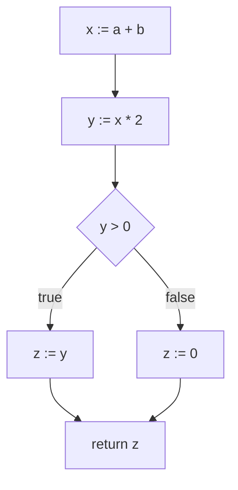

# 13 活跃变量分析

## 本章解决什么问题

寄存器有限，临时变量很多。两个变量如果不会在同一时间被使用，就可以共用一个寄存器。活跃变量分析用于判断某个程序点上哪些变量“将来还会被用到”。

## 活跃的定义

变量 `x` 在程序点 `p` 活跃，如果从 `p` 出发存在一条路径，会在重新定义 `x` 之前使用 `x`。

直觉：如果 `x` 的当前值将来还要用，它就是 live。

## Control Flow Graph

CFG：

- 节点：语句或基本块。
- 边：控制流可能流向。



## use 与 def

对每条指令：

- `use[n]`：执行该节点前必须读取的变量。
- `def[n]`：该节点定义/写入的变量。

例：

```text
x := y + z
```

```text
use = {y, z}
def = {x}
```

常见指令的 `use/def`：

| 指令 | use | def |
|---|---|---|
| `x := y + z` | `{y,z}` | `{x}` |
| `x := 1` | `{}` | `{x}` |
| `x := y` | `{y}` | `{x}` |
| `if x < y goto L` | `{x,y}` | `{}` |
| `return x` | `{x}` 加上调用约定要求的寄存器 | `{}` |
| `x := call f(a,b)` | `{a,b}` 加参数寄存器 | `{x}` 加 caller-save clobber |
| `MEM[p] := x` | `{p,x}` | `{}` |
| `x := MEM[p]` | `{p}` | `{x}` |

如果以基本块为节点，也常写 `gen/kill`：

```text
gen[B]  = 块内先使用、且使用前没有在本块定义的变量
kill[B] = 块内定义过的变量
in[B]   = gen[B] union (out[B] - kill[B])
```

指令级 `use/def` 和基本块级 `gen/kill` 是同一思想的两种粒度。

## 数据流方程

活跃变量是反向数据流问题：

```text
out[n] = union in[s] for all successors s of n
in[n]  = use[n] union (out[n] - def[n])
```

解释：

- 一个变量在 `n` 后活跃，如果它在某个后继入口活跃。
- 一个变量在 `n` 前活跃，如果 `n` 使用它，或者它在 `n` 后还活跃且没有被 `n` 重定义。

## 迭代算法

```text
for all n:
  in[n] = {}
  out[n] = {}
repeat until no change:
  for n in reverse order:
    out[n] = union in[s] for successors s
    in[n] = use[n] union (out[n] - def[n])
```

从空集开始迭代，最终收敛到最小不动点。

## 构造干涉图

如果变量 `a` 和 `b` 在某个程序点同时活跃，它们不能分到同一个寄存器，需要在干涉图中连边。

对于指令：

```text
def d
live-out = {a, b, c}
```

通常给 `d` 和 live-out 中每个变量连边。

Move 指令特殊：

```text
a := b
```

如果可能把 `a` 和 `b` 分到同一个寄存器，这条 move 可以消除。因此构图时常不立即给 move 的源和目标连干涉边，而记录为 coalescing 候选。

更精确地说，对普通定义 `d := ...`：

```text
for each v in liveOut[n]:
  add edge d-v
```

对 move `d := s`：

```text
for each v in liveOut[n] - {s}:
  add edge d-v
record move(d,s) as coalescing candidate
```

这样如果 `d` 和 `s` 不干涉，就可能把二者合并到同一个寄存器，删除 move。

## 例题：带分支 CFG 的手算

代码：

```text
1: a := 1
2: b := 2
3: if c goto 5
4: a := b + 1
5: d := a + b
6: return d
```

后继：

| 行 | succ |
|---|---|
| 1 | 2 |
| 2 | 3 |
| 3 | 4,5 |
| 4 | 5 |
| 5 | 6 |
| 6 | empty |

`use/def`：

| 行 | use | def |
|---|---|---|
| 1 | `{}` | `{a}` |
| 2 | `{}` | `{b}` |
| 3 | `{c}` | `{}` |
| 4 | `{b}` | `{a}` |
| 5 | `{a,b}` | `{d}` |
| 6 | `{d}` | `{}` |

从空集开始反向迭代。第一轮从 6 到 1：

| 行 | in | out |
|---|---|---|
| 6 | `{d}` | `{}` |
| 5 | `{a,b}` | `{d}` |
| 4 | `{b}` | `{a,b}` |
| 3 | `{a,b,c}` | `{a,b}` |
| 2 | `{a,c}` | `{a,b,c}` |
| 1 | `{c}` | `{a,c}` |

第二轮重新计算不再变化，所以达到 fixed point。

干涉图：

- 行 1 定义 `a`，`out={a,c}`，忽略自边，得 `a-c`。
- 行 2 定义 `b`，`out={a,b,c}`，得 `b-a`、`b-c`。
- 行 4 定义 `a`，`out={a,b}`，得 `a-b`。
- 行 5 定义 `d`，`out={d}`，无新增。

最终边：

```text
a-b, a-c, b-c
```

`d` 只在 return 前后活跃，不与其他变量同时活跃。

## 例题：循环 CFG 的多轮迭代

代码：

```text
1: i := 0
2: if i < n goto 3 else 5
3: sum := sum + i
4: i := i + 1
   goto 2
5: return sum
```

后继：`1->2`，`2->3,5`，`3->4`，`4->2`，`5->empty`。

`use/def`：

| 行 | use | def |
|---|---|---|
| 1 | `{}` | `{i}` |
| 2 | `{i,n}` | `{}` |
| 3 | `{sum,i}` | `{sum}` |
| 4 | `{i}` | `{i}` |
| 5 | `{sum}` | `{}` |

因为有回边 `4->2`，一轮通常不够。迭代到不动点后：

| 行 | in | out |
|---|---|---|
| 1 | `{n,sum}` | `{i,n,sum}` |
| 2 | `{i,n,sum}` | `{i,n,sum}` |
| 3 | `{i,n,sum}` | `{i,n,sum}` |
| 4 | `{i,n,sum}` | `{i,n,sum}` |
| 5 | `{sum}` | `{}` |

解释：`sum` 在循环中每轮被读写，并且退出后 return；`n` 每次测试都要用；`i` 从测试、循环体到自增都活跃。循环让这些变量通过回边持续活跃。

## 例题

代码：

```text
1: a := 1
2: b := a + 2
3: c := b + a
4: return c
```

use/def：

| 行 | use | def |
|---|---|---|
| 1 | {} | {a} |
| 2 | {a} | {b} |
| 3 | {b,a} | {c} |
| 4 | {c} | {} |

反向计算：

| 行 | in | out |
|---|---|---|
| 4 | {c} | {} |
| 3 | {a,b} | {c} |
| 2 | {a} | {a,b} |
| 1 | {} | {a} |

干涉边：

- 行 2 定义 `b`，out 为 `{a,b}`，所以 `b` 与 `a` 干涉。
- 行 3 定义 `c`，out 为 `{c}`，无新增边。

## 常见误区

- 活跃变量分析是反向传播，不是顺着执行方向算。
- `out` 看后继的 `in`，不是看前驱。
- `def` 会杀死旧值，但如果右侧也用到同名变量，要先算 use。
- 静态分析是保守近似，不等于一次具体执行。
- Move 指令构图要特殊处理，否则会错失合并机会。

## 练习

1. 给一段三地址码，写出每行 `use/def`。
2. 画 CFG 并迭代计算 `in/out`。
3. 根据 live-out 构造干涉图。
4. 说明 move 指令 `x := y` 为什么适合 coalescing。

## 练习参考答案

见 [23_练习参考答案.md](23_练习参考答案.md) 中对应章节。

## 术语中英对照

| English | 中文 | 考试提示 |
|---|---|---|
| liveness analysis | 活跃变量分析 | 判断未来是否还会用 |
| live variable | 活跃变量 | 当前值将来可能被读 |
| live range | 活跃范围 | 一个值从定义到最后使用的范围 |
| control-flow graph, CFG | 控制流图 | 数据流分析基础 |
| flow graph | 流图 | CFG 的常见说法 |
| use set | use 集 | 节点读取变量 |
| def set | def 集 | 节点定义变量 |
| gen set | gen 集 | 基本块先使用的变量 |
| kill set | kill 集 | 基本块中定义的变量 |
| live-in | 入口活跃集合 | `in[n]` |
| live-out | 出口活跃集合 | `out[n]` |
| dataflow equation | 数据流方程 | in/out 递推 |
| fixed point | 不动点 | 迭代收敛结果 |
| successor | 后继 | 控制流下一节点 |
| predecessor | 前驱 | 控制流上一节点 |
| interference graph | 干涉图 | 同时活跃则连边 |
| move instruction | move 指令 | 可能 coalesce |
