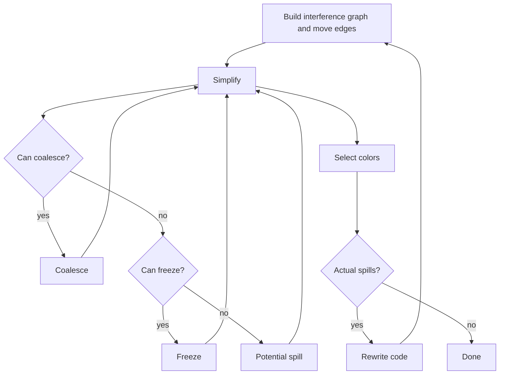

# 14 寄存器分配

## 本章只学到哪里

这一章接在 liveness analysis 后面，回答后端的最后一个大问题：

```text
无限多个 temporaries 如何放进有限个 physical registers？
```

PPT 的主线不是机器码细节，而是一个图着色框架：

1. 从 liveness 构造 interference graph。
2. 用 `K` 种颜色给图着色，`K` 是可用物理寄存器数。
3. 尽量用 coalescing 删除 move。
4. 寄存器不够时 spill 到栈帧。
5. spill 改写程序后重新做 liveness 和寄存器分配。

考试重点是手算流程和判断题，不要求证明图着色 NP-complete，也不要求实现完整 worklist allocator。

## 本章考试能力清单

- 概念题：能解释 register allocation、interference graph、K-coloring、degree、precolored node、move-related。
- 判断题：能分清 potential spill 和 actual spill，能判断 freeze、coalescing、precolored、caller-save/callee-save 的说法。
- 手算题：能执行 simplify/select，写出 select stack，反向弹栈着色。
- 合并题：能用 Briggs/George criterion 判断 move 是否可合并。
- 大题：能算 spill priority，选择 spill 变量，插入 load/store，重新说明为什么要重建 liveness/interference graph。

## 为什么需要 Register Allocation

前面 instruction selection 生成的是 abstract assembly。它里面通常仍然有很多 temporaries：

```text
t17 <- t3 + t9
t18 <- M[t17]
t19 <- t18 + 1
```

真实机器只有有限寄存器：

```text
r1, r2, ..., rK
```

寄存器分配的目标：

| 目标 | 含义 |
|---|---|
| correctness | 同时活跃的值不能放同一个寄存器 |
| performance | 尽量少访问内存，尽量删掉无用 move |
| calling convention | 参数、返回值、caller-save/callee-save 等硬件约束必须满足 |

最朴素做法是把所有 temporaries 都放栈上，需要就 load，用完就 store。它正确但慢。PPT 重点讲 global graph coloring，因为它能跨 basic block 利用 liveness 信息。

## 输入和输出

寄存器分配通常发生在：

```text
Instruction Selection -> Abstract Assembly -> Flow Graph -> Liveness
-> Interference Graph -> Register Allocation -> Final Assembly
```

输入：

- abstract assembly 指令。
- 每条指令的 `use/def`。
- liveness 的 `live-in/live-out`。
- move 指令信息。
- 可用物理寄存器集合和 calling convention。

输出：

- 每个 ordinary temporary 分到一个 physical register，或者被 spill 到 frame slot。
- 可删除的 move 被删掉。
- spill 引入的 load/store 被插入。

## 从 Liveness 到 Interference Graph

interference graph 是寄存器分配的核心数据结构。

| 图中元素 | 含义 |
|---|---|
| node | temporary 或 physical register |
| edge | 两个值不能共用寄存器 |
| color | physical register |

普通规则：

```text
如果一条指令定义 a，且 live-out = {b1, b2, ..., bj}
则 a 与每个 live-out 变量连 interference edge。
```

也就是：

```text
for b in live_out[n]:
    if b != a:
        add_edge(a, b)
```

直觉：

- 指令结束后 `a` 的新值存在。
- `live-out` 里的变量之后还要用。
- 因此 `a` 不能覆盖这些变量所在寄存器。

## Move 指令的特殊建图规则

move 是：

```text
a <- c
```

如果最后 `a` 和 `c` 分到同一个寄存器，这条 move 可以删掉。所以构造干涉图时，对 move 要留出合并机会：

| 指令类型 | 加干涉边 |
|---|---|
| non-move，例如 `a <- b + c` | `a` 与所有 `live-out` 连边 |
| move，例如 `a <- c` | `a` 与 `live-out - {c}` 连边，暂时不连 `a-c` |

同时记录一条 move edge：

```text
a --move-- c
```

注意：

- move edge 不是 interference edge。
- move edge 表示“如果安全，希望以后合并”。
- 如果后面某条 non-move 重新定义 `a`，而 `c` 仍 live，普通规则会重新产生 `a-c` 干涉边。

这正是 coalescing 能工作的前提。

## 图着色模型

K-coloring：

```text
用最多 K 种颜色给图中节点着色，使每条边两端颜色不同。
```

寄存器分配对应关系：

| 图着色 | 寄存器分配 |
|---|---|
| color | physical register |
| adjacent nodes different colors | 干涉的 temporaries 不能共用寄存器 |
| K-colorable | 可用 K 个寄存器完成分配 |
| not colored | 可能需要 spill |

复杂度只需记结论：

- 找最小颜色数是 NP-hard。
- 判断给定 `K` 是否可着色是 NP-complete。
- 编译器实际使用启发式算法，不追求数学最优。

## Kempe 定理和 Simplify

PPT 的关键定理：

```text
如果图 G 中有节点 n，degree(n) < K，
且 G - {n} 可以 K-color，
那么 G 也可以 K-color。
```

原因很直观：

- `n` 最多有 `K-1` 个邻居。
- 邻居最多占用 `K-1` 种颜色。
- 还剩至少 1 种颜色可以给 `n`。

这种节点叫 insignificant-degree node 或 low-degree node。它可以先从图中移除，等最后再着色。

## Simplify / Select 基本算法

最基础的图着色分两阶段。

### Simplify

```text
while graph has a node n with degree(n) < K:
    remove n and its edges from graph
    push n onto selectStack
```

这一阶段只是构造栈，不分配寄存器。

### Select

图空后反向弹栈：

```text
while selectStack not empty:
    pop n
    restore n into graph
    choose a color not used by colored neighbors
```

做题时最重要的习惯：

```text
删除阶段看当前剩余图的 degree。
着色阶段看已经弹出并着色的邻居。
```

不要在 simplify 时提前给颜色。

## 基础手算模板

给定干涉图和 `K`：

```text
1. 写每个节点初始 degree。
2. 找 degree < K 的节点，删掉并压栈。
3. 更新邻居 degree，继续删低度节点。
4. 如果图空，开始 select。
5. 从栈顶反向弹出。
6. 每个节点选择一个没有被已着色邻居占用的颜色。
7. 每条边两端颜色不同即合法。
```

如果有多个低度节点，选择顺序可能不唯一；只要最终颜色合法，通常都可得分。

## 例题：K=3 基础着色

干涉边：

```text
a-b, a-c, b-c, b-e, c-d, d-e
```

初始 degree：

| 节点 | degree |
|---|---:|
| `a` | 2 |
| `b` | 3 |
| `c` | 3 |
| `d` | 2 |
| `e` | 2 |

`K=3`，低度节点是 degree `< 3` 的节点。

删除阶段一种合法顺序：

| 步骤 | 删除节点 | 原因 | selectStack |
|---|---|---|---|
| 1 | `a` | degree 2 | `a` |
| 2 | `d` | degree 2 | `a,d` |
| 3 | `e` | 删除 `d` 后仍可删 | `a,d,e` |
| 4 | `b` | degree 降低到 `<3` | `a,d,e,b` |
| 5 | `c` | 最后剩下 | `a,d,e,b,c` |

着色阶段反向弹栈。设颜色为 `R1,R2,R3`：

| 弹出 | 已着色邻居 | 可选颜色 | 一种选择 |
|---|---|---|---|
| `c` | 无 | `R1,R2,R3` | `R1` |
| `b` | `c=R1` | `R2,R3` | `R2` |
| `e` | `b=R2` | `R1,R3` | `R1` |
| `d` | `c=R1,e=R1` | `R2,R3` | `R2` |
| `a` | `b=R2,c=R1` | `R3` | `R3` |

这是一种合法 3 色着色。

## Simplify 失败不等于不可着色

如果某一步剩下的所有节点 degree 都 `>= K`，基础 simplify 会卡住。

但这不代表图一定不可 K-color。

原因：

- degree 是保守判断。
- 一个节点有 `K` 个邻居，不代表这些邻居最后一定用了 `K` 种不同颜色。

因此 PPT 引入 optimistic coloring。

## Potential Spill 与 Optimistic Coloring

当没有 degree `< K` 的节点时，选择一个节点作为 potential spill：

```text
choose n as potential spill
remove n from graph
push n onto selectStack
continue simplify
```

这里的含义是：

```text
先乐观假设 n 最后可能还能着色。
```

potential spill 不是实际 spill。它只是“如果最后不行，再真的溢出”。

## Select 阶段判断 Actual Spill

到了 select 阶段，弹出一个 potential spill 节点 `n`：

| 情况 | 结果 |
|---|---|
| 邻居实际占用颜色数 `< K` | `n` 仍能着色，不 spill |
| 邻居实际占用颜色数 `= K` | `n` 没颜色可选，成为 actual spill |

所以：

```text
potential spill may or may not become actual spill.
```

判断题常考：

- “选为 potential spill 就一定会 spill”是错的。
- “actual spill 后需要改写程序并重新分析”是对的。

## Actual Spill 如何改写程序

如果 `c` 成为 actual spill：

1. 在当前函数栈帧中分配一个 slot，例如 `c_loc`。
2. 每次 use `c` 前插入 load 到新 temporary。
3. 每次 def `c` 后插入 store 到 `c_loc`。

原代码：

```text
1: t <- a + b
2: c <- t * d
3: e <- c + t
```

若 `t` spill 到 `slot_t`：

```text
1: t1 <- a + b
   M[slot_t] <- t1
2: t2 <- M[slot_t]
   c <- t2 * d
3: t3 <- M[slot_t]
   e <- c + t3
```

为什么要引入 `t1/t2/t3`？

- 原来的 `t` 活跃范围可能很长。
- 新 temporaries 只在 load/store 附近短暂 live。
- 下一轮寄存器分配更容易给它们分到寄存器。

为什么必须重新做 liveness？

```text
程序已经变了：新增了 load/store，也新增了 temporaries。
旧的 live-in/live-out 和干涉图不再适用。
```

## Spill Priority

PPT 后半部分用一个启发式选择 spill 候选：

```text
spill priority = spill cost / degree
```

其中：

- cost 越大，越不想 spill。
- degree 越大，spill 后释放的干涉约束越多。
- priority 越低，越适合选为 spill candidate。

课件示例常写成：

```text
priority = (uses+defs outside loop + 10 * (uses+defs inside loop)) / degree
```

如果题目说循环平均执行 `n` 次，就把 `10` 换成 `n`：

```text
priority = (outside_count + n * inside_count) / degree
```

答题步骤：

```text
1. 只统计需要寄存器分配的 ordinary temporaries。
2. 对每个变量数 uses + defs。
3. 循环内 uses/defs 乘循环权重。
4. 查原始干涉图 degree。
5. 算 priority。
6. 选择 priority 最低者作为 spill candidate。
```

## Spill Priority 示例

PPT 的 `K=3` 示例给出：

```text
enter:
  c <- r3
  a <- r1
  b <- r2
  d <- 0
  e <- a
loop:
  d <- d + b
  e <- e - 1
  if e > 0 goto loop
  r1 <- d
  r3 <- c
  return (r1, r3 live out)
```

若循环权重按 10 估计，课件表格是：

| node | outside uses+defs | inside uses+defs | degree | priority |
|---|---:|---:|---:|---:|
| `a` | 2 | 0 | 4 | `(2+10*0)/4=0.5` |
| `b` | 1 | 1 | 4 | `(1+10*1)/4=2.75` |
| `c` | 2 | 0 | 6 | `(2+10*0)/6=0.33` |
| `d` | 2 | 2 | 4 | `(2+10*2)/4=5.5` |
| `e` | 1 | 3 | 3 | `(1+10*3)/3=10.33` |

priority 最低的是 `c`，所以选择 `c` 作为 spill candidate。

如果题目把“循环平均执行 10 次”改成“执行 `n` 次”，就把每个循环内计数乘 `n`，再比较表达式。

## Coalescing：为什么要合并 Move

move 指令：

```text
a <- b
```

如果 `a` 和 `b` 最终分到同一个寄存器：

```text
r1 <- r1
```

这条 move 可以删除。coalescing 就是把 move 的源和目标合并成一个节点。

合并前：

```text
a --move-- b
```

合并后：

```text
ab
```

新节点的干涉邻居是两边原邻居的并集。

## Coalescing 的风险

coalescing 可能让图更容易着色，也可能让图更难着色。

好处：

- 删除 move。
- 合并后一些邻居 degree 可能下降。

风险：

- 合并节点拥有更多邻居。
- 原本可 K-color 的图，合并后可能不可 K-color。

所以实际算法用 conservative coalescing：

```text
只在看起来不会破坏可着色性的情况下合并。
```

## Briggs Criterion

Briggs 判据：

```text
普通节点 a 和 b 可以合并，
如果合并后的节点 ab 的 high-degree neighbors 数量 < K。
```

high-degree neighbor 指：

```text
degree >= K
```

直觉：

- low-degree 邻居之后可以先被 simplify 掉。
- 如果合并节点周围危险邻居少于 `K` 个，最后它仍有希望变成 low-degree。

考试说法：

```text
Briggs 看 merged node 的高阶邻居数量。
通常用于 ordinary temporary 与 ordinary temporary 的 move。
```

## George Criterion

George 判据：

```text
把 a 合并到 b 时，对 a 的每个邻居 t：
  t 已经与 b 干涉，或
  t 是 low-degree 节点。
```

直觉：

- 如果 `t` 已经与 `b` 干涉，合并不会给 `t` 增加新约束。
- 如果 `t` 是 low-degree，即使多一点约束也仍然比较安全。

考试说法：

```text
George 逐个检查一边节点的邻居。
通常用于涉及 precolored node 的 move。
```

## Briggs 与 George 对比

| 项目 | Briggs | George |
|---|---|---|
| 看什么 | 合并节点的 high-degree 邻居数 | 某一边节点的每个邻居 |
| 常用场景 | ordinary-ordinary move | precolored-ordinary move |
| 关键条件 | high-degree neighbors `< K` | 邻居已干涉目标或 low-degree |
| 直觉 | merged node 以后还能 simplify | 合并不新增危险约束 |

只要题目没有 precolored node，优先想到 Briggs。看到 physical register/precolored node，优先想到 George。

## Constrained Move

constrained move 是：

```text
move 的 source 和 destination 已经干涉。
```

这种 move 不可能通过 coalescing 删除，因为两端不能同色。

处理：

- 从待合并 move 集合中移除。
- 不再把相关节点仅仅因为这条 move 视为 move-related。
- 继续 simplify/freeze/coalesce。

判断题要点：

```text
有 interference edge 的两个节点不能合并。
```

## 完整算法：Iterated Register Coalescing

PPT 的优化流程是：

```text
Build -> Simplify -> Coalesce -> Freeze -> Potential Spill
-> Select -> Actual Spill/Rewrite -> Build ...
```

可以画成：



更考试化的阶段表：

| 阶段 | 做什么 | 易错点 |
|---|---|---|
| Build | 构造 interference graph，记录 move edges | move 不直接连源目标干涉边 |
| Simplify | 删除 low-degree 且 non-move-related 的 ordinary nodes | 有 move 的低度节点先不要急着删 |
| Coalesce | 用 Briggs/George 安全合并 move 两端 | 合并后回到 simplify |
| Freeze | 放弃某些 low-degree move-related 节点上的 move | freeze 后可继续 simplify/coalesce |
| Potential Spill | 没有低度节点时选 spill candidate | 不是 actual spill |
| Select | 弹栈着色 | 这里才发现 actual spill |
| Rewrite | 对 actual spill 插入 load/store | 重新 build/liveness/regalloc |

## Move-Related 与 Non-Move-Related

一个节点如果参与尚未处理的 move，就叫 move-related。

为什么 simplify 只优先删 non-move-related 低度节点？

```text
因为 move-related 节点可能还能 coalesce。
过早删掉会错过删除 move 的机会。
```

但如果无法 coalesce，就需要 freeze，让它不再阻塞 simplify。

## Freeze 的精确定义

Freeze 发生在：

```text
不能 simplify，也没有安全 coalesce 可以做，
但还有 low-degree move-related node。
```

操作：

```text
选择一个低度 move-related 节点，
冻结与它相关的 move，
放弃这些 move 的 coalescing 机会。
```

效果：

- 这些 move 从 coalescing candidate 集合中移除。
- 节点可能变成 non-move-related。
- 算法可以继续 simplify。
- 其他 move 仍可能继续 coalesce。

判断题重点：

| 说法 | 判断 | 原因 |
|---|---|---|
| freeze 在不能 simplify 也不能 coalesce 后进行 | 对 | 这是流程顺序 |
| freeze 通常选 low-degree move-related node | 对 | 冻结后可进入 simplify |
| freeze 把 interference edge 改成 non-move-related edge | 错 | move edge 不是 interference edge；freeze 是冻结 move 候选 |
| freeze 后可以继续 simplify/coalesce | 对 | 节点状态变化后算法继续迭代 |

如果 PPT 口语说“把 move edge 变成 regular edge”，考试答题要更精确：不合并、不新增干涉边，只是把这条 move 标记为 frozen，不再阻碍 simplify。

## Worklist 名字只需认得

完整实现会维护很多集合，考试一般不会让你写代码，但题干可能出现这些词。

节点集合：

| 集合 | 含义 |
|---|---|
| `simplifyWorklist` | low-degree、non-move-related，可 simplify |
| `freezeWorklist` | low-degree、move-related，可能 freeze |
| `spillWorklist` | high-degree，可能 potential spill |
| `selectStack` | 被删除节点的栈 |
| `coalescedNodes` | 已合并到其他节点的节点 |
| `coloredNodes` | 已成功着色节点 |
| `spilledNodes` | select 阶段实际 spill 的节点 |

move 集合：

| 集合 | 含义 |
|---|---|
| `worklistMoves` | 等待尝试 coalesce |
| `activeMoves` | 暂时不能处理 |
| `coalescedMoves` | 已通过合并删除 |
| `constrainedMoves` | 两端已干涉，不能合并 |
| `frozenMoves` | 已放弃合并 |

记忆主线：

```text
先删安全低度节点；
move 能安全合并就合并；
合不了但节点低度就 freeze；
再不行才 potential spill。
```

## Precolored Nodes

physical registers 在图里也可以建成节点，叫 precolored nodes。

例子：

- argument register。
- return-value register。
- caller-save register。
- callee-save register。
- frame pointer、stack pointer 等固定寄存器。

规则：

| 规则 | 原因 |
|---|---|
| precolored nodes 两两干涉 | 两个物理寄存器不能是同一个颜色 |
| 不能 simplify | 它们颜色固定，不能从图中“希望以后再着色” |
| 不能 spill | physical register 不是普通 temporary |
| 不能重新着色 | 颜色由硬件/调用约定固定 |
| 当作 infinite degree | 避免被普通低度规则删除 |

算法目标变成：

```text
不断 simplify/coalesce/freeze/spill ordinary nodes，
直到图中只剩 precolored nodes。
```

## Precolored Coalescing 为什么用 George

如果 move 涉及 precolored node：

```text
t <- r1
```

希望把 `t` 合并到 `r1`，这样 move 可以删除，`t` 也直接使用 `r1`。

但 Briggs 对 precolored node 太保守：

- precolored node 视为 infinite degree。
- 合并节点的 high-degree 邻居数很容易看起来过大。

所以实际常用 George：

```text
precolored a 和 ordinary b 可合并，
如果对 b 的每个邻居 t：
  t 已经与 a 干涉，或
  t 是 low-degree。
```

考题若写：

```text
use George's criterion for nodes that have already been pre-colored
use Briggs' criterion for remaining nodes
```

就是这个意思。

## 保持 Precolored Live Range 短

不要让物理寄存器节点在大段代码里一直 live。

坏写法：

```text
arg <- r1
... long code ...
use arg, but r1 is treated as live too long
```

好写法：

```text
t_arg <- r1
... long code ...
use t_arg
```

好处：

- `r1` 很快不再 live，释放硬件寄存器。
- `t_arg` 是 ordinary temporary，可以 spill，也可以与 `r1` coalesce。
- register allocator 自动决定最终是否保留 move。

## Caller-Save Registers

caller-save 的含义：

```text
函数调用可能破坏这些寄存器。
如果 caller 还需要里面的值，caller 自己负责保存。
```

图着色中的建模：

```text
CALL instruction defines/clobbers all caller-save registers.
```

如果变量 `x` 跨 call 仍 live：

```text
CALL 的 live-out 中有 x
CALL def caller-save registers
```

于是会产生：

```text
x interferes with each caller-save register
```

结果：

- 跨 call 活跃的变量不会被分到 caller-save。
- 不跨 call 的变量仍可自然使用 caller-save。
- 不需要额外 if 判断，约束已经编码进干涉图。

## Callee-Save Registers

callee-save 的含义：

```text
callee 如果使用这些寄存器，必须在返回前恢复原值。
```

PPT 的建模方法是用 entry/exit move：

```text
enter:
  t_save <- r7
...
exit:
  r7 <- t_save
```

两种结果：

| 情况 | 结果 |
|---|---|
| 寄存器压力低 | `t_save` 与 `r7` coalesce，move 删除，几乎无成本 |
| 寄存器压力高 | `t_save` spill 到栈上，效果就是保存/恢复 `r7` |

因此 graph coloring allocator 可以自动决定是否真正保存 callee-save register。

## Calling Convention 与题目中的 Precolored

如果题目写：

```text
call f (use r1 and r2, def r1)
return (r1 live out)
```

要读成：

- `r1/r2/r3` 是 precolored physical registers。
- call 使用参数寄存器 `r1/r2`。
- call 定义返回寄存器 `r1`，也可能 clobber caller-save 集合。
- return 要求 `r1` live out，表示返回值必须在 `r1`。

做干涉图和着色时，precolored node 的颜色已经固定。

## 大题手算模板：寄存器分配全流程

大题通常给原始程序、live-out 或原始干涉图、`K` 个寄存器和若干 move。作答可以按这个顺序：

```text
1. 标出 precolored nodes 和 ordinary temporaries。
2. 根据 live-out 或给定图确认 interference edges。
3. 标出 move edges。
4. 计算每个 ordinary node 的 degree。
5. 如果需要 spill priority：
   priority = weighted uses+defs / degree。
6. Build 后进入 worklist：
   low-degree non-move-related -> simplify
   low-degree move-related -> freeze/coalesce
   high-degree -> spillWorklist
7. Simplify：
   删除节点，压 selectStack，更新 degree。
8. Coalesce：
   precolored 用 George，ordinary 用 Briggs。
   合并后更新图和 move 状态。
9. Freeze：
   没法 simplify/coalesce 时，冻结低度 move-related 节点相关 moves。
10. Potential Spill：
   没有低度节点时选 priority 低的候选，压栈继续。
11. Select：
   反向弹栈，避开已着色邻居颜色。
12. Actual Spill：
   若无色可选，插入 load/store，重新做 liveness 和 allocation。
13. 最终 rewrite：
   删除 source/destination 同寄存器的 move。
   把 temporaries 替换为 registers。
   保留 spill 的 load/store。
```

写答案时不要只写最终颜色。寄存器分配大题通常给步骤分，尤其看：

- simplify 顺序。
- coalesce 判据。
- freeze 发生原因。
- spill 选择依据。
- selectStack。
- final coloring。
- final rewritten program。

## 大题模板：Spill Rewrite

若选择 spill 变量 `v`：

```text
allocate frame slot v_loc
```

每次 use：

```text
v_use_i <- M[v_loc]
... use v_use_i instead of v ...
```

每次 def：

```text
v_def_i <- ...
M[v_loc] <- v_def_i
```

如果一条指令同时 use 和 def `v`：

```text
v_old <- M[v_loc]
v_new <- v_old + 1
M[v_loc] <- v_new
```

spill 后不能只从原干涉图删掉 `v`。必须重新：

```text
new assembly -> flow graph -> liveness -> interference graph -> allocation
```

## PPT K=3 例子的思路

课件的大例子中：

```text
c <- r3
a <- r1
b <- r2
d <- 0
e <- a
loop:
  d <- d + b
  e <- e - 1
  if e > 0 goto loop
  r1 <- d
  r3 <- c
  return
```

重要结论：

1. `r1/r2/r3` 是 precolored nodes。
2. `c` 的 spill priority 最低，先选 `c`。
3. 普通节点合并用 Briggs，例如 `a&e`。
4. 涉及 precolored 的合并用 George，例如 `b&r2`、`r1&ae`。
5. 如果合并后某个 move 两端已经干涉，它变成 constrained move。
6. 最终可删除多条 move。
7. 对 spilled `c` 插入保存/恢复：

```text
c1 <- r3
M[cloc] <- c1
...
c2 <- M[cloc]
r3 <- c2
```

这类题通常不要求你记住课件图的每条边，但要求你按题目给的图和 live-out 做同样流程。

## 判断题高频点

| 说法 | 判断 | 解释 |
|---|---|---|
| register allocation maps temporaries to physical registers | 对 | 本章核心目标 |
| graph coloring uses colors as registers | 对 | 干涉边两端不能同色 |
| degree `< K` 的节点可以安全 simplify | 对 | Kempe 定理直觉 |
| simplify 阶段已经给节点分配寄存器 | 错 | simplify 只压栈 |
| potential spill 一定 actual spill | 错 | select 时可能仍能着色 |
| actual spill 后要 rewrite 并重新 liveness | 对 | 程序和 live range 变了 |
| move 两端没有干涉就一定应该合并 | 错 | 还要满足 conservative criterion |
| constrained move 可以 coalesce | 错 | 两端已干涉 |
| precolored node 可以 spill | 错 | 物理寄存器不能 spill |
| precolored node 可以 simplify | 错 | 颜色固定，视为 infinite degree |
| precolored coalescing 常用 George | 对 | Briggs 对 infinite degree 太保守 |
| caller-save registers are defined by CALL | 对 | 用 clobber 建模 |
| freeze 会新增 source/destination 的 interference edge | 错 | freeze 是放弃 move 合并，不是新增干涉 |

## 常见误区

- 把 move edge 当成 interference edge。
- 对 move `a <- c` 仍然无条件加 `a-c` 干涉边，导致错过 coalescing。
- 删除阶段不更新 degree。
- 着色阶段按删除顺序而不是反向弹栈。
- 看到 degree `>= K` 就直接 actual spill。
- spill 后只改图不改程序。
- precolored node 当普通节点删掉。
- caller-save/callee-save 用文字硬背，不会转换成 def/use/move 建模。
- freeze 写成“合并失败就 spill”，漏掉 freeze 这个中间步骤。
- Briggs/George 混用：普通节点先想 Briggs，precolored 先想 George。

## 本章覆盖核对

| PPT 知识点 | 本章位置 |
|---|---|
| register allocation 问题定义 | 为什么需要 Register Allocation |
| graph coloring / K-coloring | 图着色模型 |
| interference graph 与 move 特殊建边 | 从 Liveness 到 Interference Graph、Move 指令的特殊建图规则 |
| Kempe theorem | Kempe 定理和 Simplify |
| simplify/select | Simplify / Select 基本算法 |
| optimistic coloring | Potential Spill 与 Optimistic Coloring |
| actual spill rewrite | Actual Spill 如何改写程序 |
| spill priority | Spill Priority |
| coalescing | Coalescing：为什么要合并 Move |
| Briggs / George | Briggs Criterion、George Criterion |
| optimized algorithm with move coalescing | 完整算法：Iterated Register Coalescing |
| freeze | Freeze 的精确定义 |
| constrained move | Constrained Move |
| precolored nodes | Precolored Nodes |
| caller-save/callee-save modeling | Caller-Save Registers、Callee-Save Registers |
| 大题流程 | 大题手算模板 |

## 练习

1. 给干涉图和 `K=3`，执行 simplify/select，并写 selectStack。
2. 对 move `a <- b` 判断是否可用 Briggs criterion 合并。
3. 对 move `t <- r1` 判断是否可用 George criterion 合并，其中 `r1` 是 precolored node。
4. 给一个变量的循环内外 use/def 次数和 degree，计算 spill priority。
5. 模拟一次 actual spill 的代码重写。
6. 说明 caller-save register 如何通过 `CALL def` 进入干涉图。
7. 说明 freeze 发生在什么阶段，以及它为什么不是 actual spill。

## 练习参考答案

见 [23_练习参考答案.md](23_练习参考答案.md) 中对应章节。

## 术语中英对照

| English | 中文 | 考试提示 |
|---|---|---|
| register allocation | 寄存器分配 | temporaries -> physical registers |
| physical register | 物理寄存器 | 真实机器寄存器 |
| temporary | 临时变量 | abstract assembly 中的无限寄存器 |
| graph coloring | 图着色 | 相邻节点颜色不同 |
| K-coloring | K 色着色 | K 个可用寄存器 |
| interference graph | 干涉图 | 不能共用寄存器的关系 |
| interference edge | 干涉边 | 两端不能同色 |
| move edge | move 边 | coalescing candidate，不是干涉边 |
| degree | 度数 | 当前图中邻居数 |
| significant degree | 高度数 | 通常指 degree `>= K` |
| insignificant degree | 低度数 | degree `< K` |
| simplify | 简化 | 删除低度节点并压栈 |
| select | 选择颜色 | 反向弹栈着色 |
| select stack | 选择栈 | simplify/potential spill 压入 |
| spill | 溢出 | 放到内存 frame slot |
| potential spill | 潜在溢出 | 乐观压栈的 spill 候选 |
| actual spill | 实际溢出 | select 时无色可选 |
| spill priority | 溢出优先级 | cost / degree，越低越适合 spill |
| coalescing | 合并 | 合并 move 两端以删除 move |
| conservative coalescing | 保守合并 | 避免破坏可着色性 |
| Briggs criterion | Briggs 判据 | ordinary-ordinary 常用 |
| George criterion | George 判据 | precolored 相关常用 |
| constrained move | 受限 move | 两端已干涉，不能合并 |
| freeze | 冻结 | 放弃某些 move 的合并机会 |
| move-related | 与 move 相关 | 参与未处理 move 的节点 |
| non-move-related | 非 move 相关 | 可优先 simplify |
| precolored node | 预着色节点 | 物理寄存器节点 |
| caller-save register | 调用者保存寄存器 | CALL 会 clobber/def |
| callee-save register | 被调用者保存寄存器 | entry/exit move 建模 |
