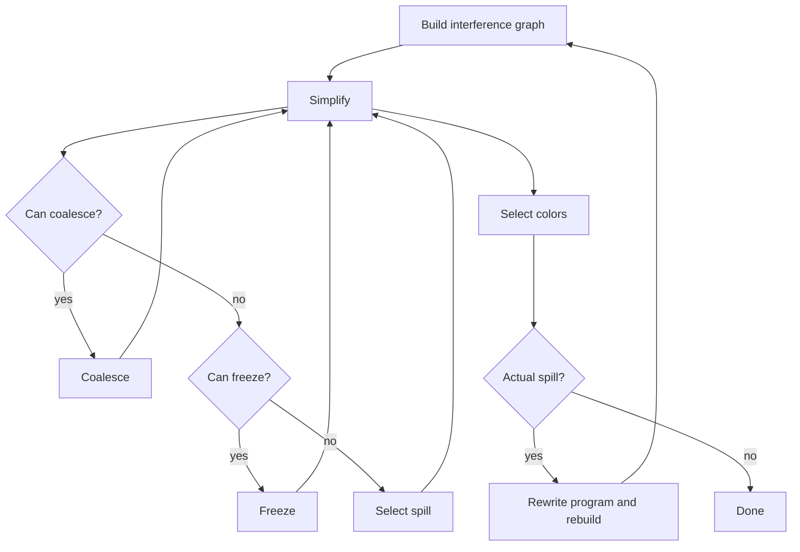

# 14 寄存器分配

## 本章解决什么问题

IR 和抽象汇编可以使用无限多个 temporaries，但真实机器寄存器数量有限。寄存器分配要把 temporaries 映射到物理寄存器。若寄存器不够，就把部分值 spill 到内存。

## 本章考试能力清单

- 概念题：能解释 graph coloring、degree、K colors、precolored node、move-related。
- 手算题：能执行 simplify/select，写 selectStack，弹栈着色，判断 actual spill。
- 合并题：能用 Briggs/George 判据判断 coalescing，能说明 freeze 何时发生。
- 重写题：能把 spilled temporary 改写成 load/store，并说明为什么要重新 liveness 和 regalloc。

## 图着色模型

构造干涉图：

- 节点：temporary。
- 边：两个 temporaries 同时活跃，不能共用寄存器。
- 颜色：物理寄存器。

问题变成：能否用 `K` 种颜色给图着色，使相邻节点颜色不同？

## Simplify

如果某个节点度数 `< K`，它总能在邻居着色后找到一种可用颜色。

算法：

1. 找度数 `< K` 的非 move-related 节点。
2. 从图中移除，压入栈。
3. 继续简化。

## Select

图空后，从栈中弹出节点，按当前邻居颜色选择可用颜色。

如果找不到颜色，则 actual spill。

## Spill

如果没有低度节点，就选择一个节点作为 potential spill，临时移除。选择依据通常是 spill cost：

```text
spill priority = use frequency / degree
```

如果 select 阶段真的无法着色，就重写程序：

- 在每次使用前插入 load。
- 在每次定义后插入 store。
- 重新做 liveness 和寄存器分配。

## Coalescing

对于 move：

```text
a := b
```

如果 `a` 和 `b` 分配到同一个寄存器，move 可以删除。合并两个节点叫 coalescing。

问题：合并后节点度数可能变大，导致原本可着色的图变得不可着色。

## Conservative Coalescing

### Briggs 判据

合并 `a` 和 `b` 后，如果高阶邻居数量少于 `K`，可以合并。

### George 判据

如果对 `a` 的每个高阶邻居 `t`，`t` 已经与 `b` 干涉，或者 `t` 是低阶节点，则可以把 `a` 合并到 `b`。

考试不一定要求完整证明，但要知道它们都是保守地避免破坏可着色性。

## Freeze

如果无法继续 simplify，也不能安全 coalesce，可以 freeze 某些 move：放弃合并，把 move-related 节点变成普通节点，以便继续 simplify。

## Precolored Nodes

物理寄存器对应的节点已经有固定颜色，不能被 simplify 掉，也不能重新着色。调用约定中的参数寄存器、返回寄存器、栈指针等都可能是 precolored。

## 完整流程



## Worklist 视角

更接近教材和真实实现的寄存器分配会维护多个集合：

| 集合 | 含义 |
|---|---|
| `simplifyWorklist` | 低度数、非 move-related，可直接 simplify |
| `freezeWorklist` | 低度数、move-related，暂时等 coalesce |
| `spillWorklist` | 高度数，可能需要 spill |
| `selectStack` | simplify/spill 时移除的节点栈 |
| `coalescedNodes` | 已经被合并到别的节点 |
| `coloredNodes` | 已成功分配颜色 |
| `spilledNodes` | select 阶段实际无法着色 |

move 也会分类：

| move 集合 | 含义 |
|---|---|
| `worklistMoves` | 等待尝试 coalesce |
| `activeMoves` | 暂时不能处理 |
| `coalescedMoves` | 已通过合并删除 |
| `constrainedMoves` | 源和目标已经干涉，不能合并 |
| `frozenMoves` | 放弃合并 |

这套名字很多，但核心流程只有一句：低度数节点先移除；move 尽量安全合并；实在不行 freeze；再不行选 spill。

## 手算图着色模板

```text
输入: 干涉图 G，寄存器数 K
1. 标出每个节点度数
2. 找 degree < K 的节点，压栈并从图中删除
3. 删除后更新邻居度数，继续找低度节点
4. 如果没有低度节点，选一个 potential spill 压栈并删除
5. 图空后，从栈顶开始弹出
6. 每个节点选择一个没被已着色邻居使用的颜色
7. 若无颜色可选，标记 actual spill
8. 若有 actual spill，插入 load/store 后重新分析
```

做题时要把“删除阶段”和“着色阶段”分开。删除阶段只是在构造栈，不是真的给寄存器。

## 例题：K=3 着色

图：

```text
a -- b
|  /|
c  |
|  |
d -- e
```

边：

```text
a-b, a-c, b-c, b-e, c-d, d-e
```

度数：

| 节点 | 度数 |
|---|---:|
| a | 2 |
| b | 3 |
| c | 3 |
| d | 2 |
| e | 2 |

`K=3`，删除阶段找 degree `< 3`：

| 步骤 | 选择 | 原因 | selectStack |
|---|---|---|---|
| 1 | `a` | degree 2 < 3 | `a` |
| 2 | `d` | 删除 a 后仍 degree 2 < 3 | `a,d` |
| 3 | `e` | 删除 d 后 degree 降低 | `a,d,e` |
| 4 | `b` | 此时 degree < 3 | `a,d,e,b` |
| 5 | `c` | 最后剩下 | `a,d,e,b,c` |

着色阶段反向弹栈。设颜色为 `R1,R2,R3`：

| 弹出 | 已着色邻居 | 可选颜色 | 选择 |
|---|---|---|---|
| `c` | 无 | `R1,R2,R3` | `R1` |
| `b` | `c=R1` | `R2,R3` | `R2` |
| `e` | `b=R2` | `R1,R3` | `R1` |
| `d` | `c=R1,e=R1` | `R2,R3` | `R2` |
| `a` | `b=R2,c=R1` | `R3` | `R3` |

结果合法：每条边两端颜色不同。

## 例题：Spill 重写

原代码：

```text
1: t := a + b
2: c := t * d
3: e := c + t
```

如果 `t` 被 actual spill 到 frame slot `slot_t`，要在每次使用前 load，在每次定义后 store，并引入新 temporary：

```text
1: t1 := a + b
   MEM[slot_t] := t1
2: t2 := MEM[slot_t]
   c := t2 * d
3: t3 := MEM[slot_t]
   e := c + t3
```

重写后必须重新做 liveness 和寄存器分配，因为新增的 `t1/t2/t3` 活跃范围较短，可能更容易分配寄存器。

## Briggs 与 George 判据例题

`K=3`，考虑合并 move `a := b`。

Briggs：

```text
合并 a,b 后，合并节点的高阶邻居数量 < K，则安全
```

如果合并后邻居中 degree >= 3 的只有 `{c,d}` 两个，`2 < 3`，可合并。

George：

```text
把 a 合并到 b 时，对 a 的每个高阶邻居 t：
  t 已经与 b 干涉，或 t 是低阶节点
```

直觉：高阶邻居最危险。如果它已经与 `b` 干涉，合并不会给它增加新的约束；低阶邻居即使增加约束也仍较安全。

## Caller-save/Callee-save 对分配的影响

如果一个 temporary 跨越函数调用仍然 live，把它放在 caller-save 寄存器会导致调用前后插入 save/restore；放在 callee-save 寄存器可能只需要函数入口/出口保存一次。

因此寄存器分配的 spill cost 或 preference 可能考虑：

- 是否 live across call。
- 使用频率。
- 保存恢复成本。
- 物理寄存器是否 precolored 或受调用约定限制。

## 常见误区

- 没有干涉边不代表一定要合并，只是允许共用寄存器。
- potential spill 不一定真的 spill。
- actual spill 后必须重写程序并重新分析。
- precolored 节点不能像普通 temporary 一样删除。
- coalescing 是为了删 move，但不能为了删 move 破坏可着色性。
- `K` 是可用物理寄存器数，不是图中节点数。
- spill 重写会产生新的 temporaries，所以必须重新做活跃变量分析。

## 练习

1. 给干涉图和 `K=3`，执行 simplify/select。
2. 对 move `a := b` 判断是否可用 Briggs 判据合并。
3. 模拟一次 actual spill 的代码重写。
4. 说明 caller-save/callee-save 如何影响干涉图和分配选择。

## 练习参考答案

见 [23_练习参考答案.md](23_练习参考答案.md) 中对应章节。

## 术语中英对照

| English | 中文 | 考试提示 |
|---|---|---|
| register allocation | 寄存器分配 | temporaries -> physical registers |
| graph coloring | 图着色 | 相邻节点颜色不同 |
| interference graph | 干涉图 | 不能共用寄存器的关系 |
| color | 颜色 | 物理寄存器 |
| simplify | 简化 | 移除低度节点 |
| select | 选择颜色 | 反向弹栈着色 |
| spill | 溢出 | 放到内存 |
| spill cost | 溢出代价 | 选择 spill 的启发式 |
| potential spill | 潜在溢出 | 暂时选作溢出候选 |
| actual spill | 实际溢出 | 着色失败后重写代码 |
| coalescing | 合并 | 合并 move 源和目标 |
| conservative coalescing | 保守合并 | 不破坏可着色性 |
| Briggs criterion | Briggs 判据 | 合并安全条件之一 |
| George criterion | George 判据 | 合并安全条件之一 |
| freeze | 冻结 | 放弃某些 move 合并 |
| precolored node | 预着色节点 | 物理寄存器节点 |
| move-related | 与 move 相关 | 参与未处理 move 的节点 |
| caller-save register | 调用者保存寄存器 | call 可能破坏 |
| callee-save register | 被调用者保存寄存器 | callee 保证恢复 |
