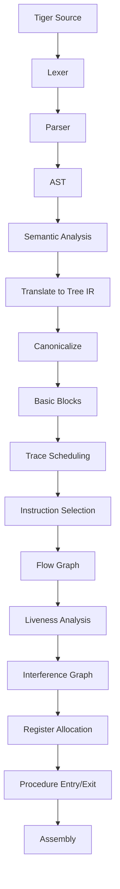

# 15 完整编译器串联

## 本章解决什么问题

前面每章讲一个阶段，本章把它们串成完整编译器。考试常会问“某个错误可能出在哪个阶段”或“某个中间产物用于什么”。

## Tiger 编译流水线



## 每阶段输入输出

| 阶段 | 输入 | 输出 |
|---|---|---|
| Lexer | 字符流 | Token |
| Parser | Token | AST |
| Semantic | AST | 类型正确、名字绑定的 AST |
| Translate | AST + environment | Tree IR fragments |
| Canon | Tree IR | 线性规范语句 |
| Basic Blocks | 语句列表 | basic block list |
| Trace | basic blocks | 重排后的语句 |
| Codegen | IR statements | abstract assembly |
| Flowgraph | assembly | CFG |
| Liveness | CFG | live sets + interference graph |
| RegAlloc | interference graph | colored assembly |
| Emit | final assembly | `.s` 文件 |

## Frame 是机器相关边界

`Frame` 模块连接前后端：

- 前端/IR 生成需要知道变量怎么访问。
- 后端需要知道实际栈帧、寄存器、调用约定。

因此 `Frame` 是“尽量隐藏机器细节，但又必须暴露必要接口”的模块。

## procEntryExit

教材常把过程入口/出口处理分成多步：

| 函数 | 作用 |
|---|---|
| `procEntryExit1` | IR 层处理 view shift、保存参数等 |
| `procEntryExit2` | 汇编层补充返回 sink、寄存器活跃信息 |
| `procEntryExit3` | 最终输出 prologue/epilogue |

## Fragment 汇总

编译器不是只输出一个函数：

- 每个函数一个 procedure fragment。
- 每个字符串常量一个 string fragment。
- 运行库函数可能需要链接。

## 定位错误

| 现象 | 可能阶段 |
|---|---|
| 关键字被识别成 ID | Lexer |
| 合法表达式 parse 失败 | Parser |
| 未声明变量没报错 | Semantic |
| 外层变量访问错 | Frame/static link/Translate |
| 条件跳转方向错 | Translate/Canon/Codegen |
| 函数调用后值丢失 | Calling convention/RegAlloc |
| 程序只在寄存器多时正确 | Liveness/RegAlloc |
| GC 回收了活对象 | GC pointer map/runtime interface |

## 完整例子：赋值表达式

源程序：

```text
x := y + 1
```

可能路径：

```text
Tokens: ID(x) ASSIGN ID(y) PLUS NUM(1)
AST: AssignExp(VarExp(x), OpExp(PLUS, VarExp(y), IntExp(1)))
Semantic: x,y declared; y:int; x:int
IR: MOVE(access(x), BINOP(PLUS, access(y), CONST(1)))
Assembly: load y; add immediate 1; store x
Liveness: y live before load; result temporary live until store
RegAlloc: map temporaries to physical registers
```

## 常见误区

- 编译器阶段不是绝对固定，真实编译器会合并或重复一些阶段。
- 中端优化可能在指令选择前后都有。
- Debug 某阶段时要看该阶段输入输出，而不是直接猜最终汇编。
- Runtime system 不是编译器之外的杂项，它影响调用、GC、对象布局。

## 练习

1. 给一个小程序，列出每阶段可能的输出。
2. 判断某个 bug 更可能出现在 lexer、parser、semantic 还是 backend。
3. 说明 `Frame` 为什么不能完全放在前端或后端。
4. 解释 procedure fragment 和 string fragment 的区别。

## 练习参考答案

见 [23_练习参考答案.md](23_练习参考答案.md) 中对应章节。

## 术语中英对照

| English | 中文 | 考试提示 |
|---|---|---|
| compilation pipeline | 编译流水线 | 阶段串联 |
| front end | 前端 | source -> AST/semantic |
| middle end | 中端 | IR analysis/optimization |
| back end | 后端 | IR/assembly -> machine code |
| fragment | 片段 | procedure/string fragment |
| procedure fragment | 过程片段 | 函数体代码 |
| string fragment | 字符串片段 | 字符串常量 |
| prologue | 过程入口代码 | 建栈帧、保存寄存器 |
| epilogue | 过程出口代码 | 恢复寄存器、返回 |
| view shift | 视图转换 | 参数从调用约定位置到 frame/formal |
| emit | 发射代码 | 输出最终汇编 |
| runtime library | 运行库 | print、alloc、GC 等支持 |

