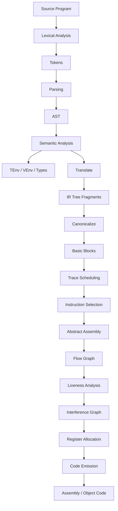

# 15 完整编译器串联

## 本章只学到哪里

这一章对应虎书 `Putting it all together` 的复习作用：不再引入一个全新的手算算法，而是把前面阶段串成一条完整编译器流水线。

考试常见问法不是“写一个完整编译器”，而是：

```text
某个中间产物由哪个阶段产生？
某个错误更可能出在哪个阶段？
某个后端现象为什么要回到前面阶段重算？
给一小段 Tiger 程序，沿 pipeline 说出关键表示。
```

本章重点是接口和依赖关系。你要能把 `Token`、`AST`、`TEnv/VEnv`、`Frame`、`IR Tree`、`canonical tree`、`basic block`、`Assem`、`CFG`、`live-out`、`interference graph`、`register assignment` 放回正确位置。

## 本章考试能力清单

- 概念题：能说清 compilation pipeline 每阶段输入输出。
- 定位题：给一个 bug 现象，能定位到 lexer/parser/semantic/frame/translate/canon/codegen/liveness/regalloc/runtime。
- 串联题：能把一个小 Tiger 片段从 token、AST、semantic、IR、assembly、liveness 到 regalloc 串起来。
- 接口题：能解释 `Frame`、`Translate`、`ProcFrag/StringFrag`、`procEntryExit`、runtime library 的职责。
- 英文题：看到 `procedure fragment`、`string fragment`、`view shift`、`code emission`、`runtime system` 能说出阶段和作用。

## 为什么需要串联章

前面章节按阶段学习，容易把知识点拆散：

```text
lexer 会切 token
parser 会建 AST
semantic 会查表
translate 会生成 IR
liveness 会算 in/out
regalloc 会图着色
```

真实编译器不是这些算法并排摆放，而是每一步都消费上一步产物，并为下一步准备更合适的接口。

虎书 Figure 1.1 的核心思想：

```text
Source Program
-> Tokens
-> Abstract Syntax
-> IR Trees
-> Canonical IR Trees
-> Assem
-> Flow Graph
-> Interference Graph
-> Register Assignment
-> Assembly Language
```

所以复习时要问两个问题：

1. 这个表示解决了什么问题？
2. 它把哪些复杂性留给了下一阶段？

## 总流水线

课程/PPT主线可以整理为：



这张图有两个考试提醒：

- `Semantic Analysis` 不只是检查类型，它会调用 `Translate` 准备 IR。
- `Register Allocation` 不是最后一步的全部；之后还要把 temporaries 替换成真实寄存器，并生成最终汇编文本。

## 每阶段输入输出

| 阶段 | 输入 | 输出 | 关键章节 |
|---|---|---|---|
| Lex | 字符流 | token 流 | 02 |
| Parse | token 流 | parse tree / AST | 03-07 |
| Semantic Analysis | AST + 环境 | 类型检查结果、绑定关系、translation 请求 | 08 |
| Escape/Frame | AST/声明信息 | `InFrame/InReg`、frame layout、static link | 09 |
| Translate | AST + `Tr_level/Tr_access` | `ProcFrag/StringFrag` 中的 IR Tree | 10 |
| Canonicalize | IR Tree | 无 `ESEQ`、CALL 规范化的线性语句 | 11 |
| Basic Blocks | 线性语句 | basic block list | 11 |
| Trace Schedule | basic blocks | trace 排序后的语句 | 11 |
| Instruction Selection | canonical IR | abstract assembly `OPER/LABEL/MOVE` | 12 |
| Flow Graph | assembly | CFG nodes/edges | 13 |
| Liveness | CFG + `use/def` | `in/out`、live sets、干涉信息 | 13 |
| Register Allocation | interference graph + move edges | register assignment、spill rewrite | 14 |
| Code Emission | colored assembly | final assembly/object code | 15 |

一个判断题陷阱：

```text
有 5 种源语言和 4 种目标机器，如果没有 IR，要写 5*4 = 20 个直接翻译器；
如果共享 IR，理想情况下写 5 个前端 + 4 个后端，不是 20 个 transitions。
```

题目若说“with an IR, should implement 20 transitions”，通常是错的。

## Front End / Middle End / Back End

| 部分 | 主要关心 | 本课阶段 |
|---|---|---|
| front end | 源语言是否合法、含义是什么 | Lex、Parse、AST、Semantic |
| middle end | 机器无关 IR 分析和优化 | IR、Canonicalize、Dataflow、Loop Optimization |
| back end | 目标机器约束 | Instruction Selection、Liveness、RegAlloc、Frame、Emit |
| runtime system | 程序运行时支持 | stack frame、heap、GC、OO layout、library calls |

注意 `Frame` 横跨前后端：

- 前端翻译变量时要知道 `x` 如何访问，是 `InReg` 还是 `InFrame(offset)`。
- 后端生成代码时要知道真实栈帧、参数寄存器、返回地址、callee-save/caller-save。

所以 `Frame` 不能完全说成“只属于前端”或“只属于后端”。它是机器相关边界。

## 关键接口 1：Token 到 AST

输入字符：

```tiger
x := y + 1
```

lexer 只负责切词：

```text
ID(x) ASSIGN ID(y) PLUS INT(1)
```

parser 负责结构：

```text
AssignExp(
  SimpleVar(x),
  OpExp(PLUS, VarExp(SimpleVar(y)), IntExp(1))
)
```

这个阶段不负责：

- `x/y` 是否声明。
- `x/y` 是否都是 int。
- `x` 在栈上还是寄存器里。
- 最后用哪条机器指令。

定位题：

| 现象 | 更可能阶段 |
|---|---|
| `<=` 被切成 `<` 和 `=` | lexer |
| `a+b*c` 结构变成 `(a+b)*c` | parser/precedence |
| `break` 出现在循环外没有报错 | semantic |

## 关键接口 2：AST 到 Semantic Environment

semantic analysis 主要回答：

```text
这个名字指向哪个声明？
这个表达式是什么类型？
这个声明会给后续环境增加什么绑定？
```

Tiger 中常见环境：

| 环境 | 存什么 |
|---|---|
| `tenv` | type name -> type |
| `venv` | variable/function name -> entry |

`venv` 里常见：

| entry | 信息 |
|---|---|
| `VarEntry` | 变量类型、访问方式 |
| `FunEntry` | 参数类型列表、返回类型、函数 level/label |

注意：

- semantic phase 会处理 shadowing 和 scope。
- type/function 递归声明常用 two-pass。
- semantic analysis 可以边检查边调用 Translate 构造 IR 表示。

## 关键接口 3：Frame / Level / Access

第 09 章和第 10 章之间最容易断。

前端看到变量 `x`，不能直接生成：

```text
TEMP x
```

它要通过 access：

```text
Tr_access = (level, F_access)
```

`F_access` 说明变量在当前 frame 中的位置：

| 形式 | 含义 |
|---|---|
| `InFrame(k)` | 存在栈帧偏移 `k` |
| `InReg(t)` | 存在 temporary/register |

`Tr_level` 说明变量属于哪一层嵌套函数。访问外层变量时要沿 static link 找到对应 frame。

考试定位：

| 现象 | 更可能阶段 |
|---|---|
| 普通局部变量地址偏移错 | Frame layout / Translate |
| 内层函数访问外层变量错 | static link / Translate |
| 函数参数在 body 里位置错 | view shift / Frame |

## 关键接口 4：Fragments

Tiger 编译器不会只产生一棵大 IR 树，而是产生 fragments。

| fragment | 内容 | 用途 |
|---|---|---|
| `ProcFrag` | 一个函数/过程的 IR body + frame | 后续生成该函数代码 |
| `StringFrag` | 字符串 label + 字符串内容 | 放入静态数据区 |

为什么需要 `StringFrag`？

```tiger
print("hello")
```

字符串常量不应在每次执行时重新构造。编译器通常把它放到静态数据区，用 label 引用。

## 关键接口 5：IR Tree 到 Canonical Tree

Translate 生成的 IR Tree 可能含有：

- `ESEQ`。
- 表达式内部有 side effect。
- `CALL` 嵌在复杂表达式里。
- `CJUMP` 的布局不方便下一阶段处理。

Canonicalize 做三件事：

```text
1. eliminate ESEQ
2. move CALL to top-level form
3. linearize statements
```

然后 Basic Blocks 和 Trace Scheduling 继续处理控制流：

```text
linear stm list -> basic blocks -> traces -> nicer fall-through layout
```

这一步的目标不是优化算法本身，而是给 instruction selection 一个规整输入。

## 关键接口 6：IR 到 Abstract Assembly

Instruction Selection 把 IR Tree 的 tile 映射成抽象汇编。

抽象汇编仍然不是最终汇编，因为里面有：

- temporaries。
- abstract labels。
- `src/dst/jumps` 列表。
- 可能还没有真实寄存器名。

Tiger 的 `AS_instr` 常见三类：

| 指令 | 作用 |
|---|---|
| `OPER` | 普通操作，带 `dst/src/jumps` |
| `LABEL` | 标签 |
| `MOVE` | 拷贝，后续可 coalesce |

这些字段直接服务下一步：

```text
src -> use
dst -> def
jumps -> CFG successors
MOVE -> move-related / coalescing candidate
```

## 关键接口 7：Assembly 到 Flow Graph / Liveness

从 abstract assembly 构造 flow graph：

| 指令情况 | CFG 边 |
|---|---|
| 普通指令 | 到下一条指令 |
| unconditional jump | 到目标 label |
| conditional jump | 到目标 label 和 fall-through |
| return | 到函数出口或无后继 |

liveness 再用：

```text
out[n] = union in[s] for s in succ[n]
in[n] = use[n] union (out[n] - def[n])
```

产生的 live sets 用来构造 interference graph。

## 关键接口 8：Liveness 到 Register Allocation

register allocation 需要：

- interference graph。
- move edges。
- precolored physical registers。
- calling convention。

输出：

```text
temporary -> physical register
```

如果 actual spill：

```text
insert load/store
new assembly
new CFG
new liveness
new interference graph
new register allocation
```

这就是后端闭环。考试问“为什么 spill 后要重新分析”，答案不是“为了更准确”这么泛，而是：

```text
程序指令和 temporaries 已经改变，旧 use/def/in/out/interference graph 不再对应新程序。
```

## procEntryExit

过程入口和出口不是某一个阶段一次性完成的，虎书常拆成几步：

| 函数 | 大致位置 | 作用 |
|---|---|---|
| `procEntryExit1` | IR/Frame 层 | view shift，把参数从调用约定位置搬到函数内部访问位置；处理 callee-save 抽象保存 |
| `procEntryExit2` | 汇编/liveness 前后 | 补充 return sink，告诉 liveness 哪些寄存器在函数出口仍 live |
| `procEntryExit3` | emit 最后 | 生成真实 prologue/epilogue 文本 |

常见内容：

- 建立和释放 stack frame。
- 保存/恢复 callee-save registers。
- 设置 frame pointer / stack pointer。
- 把返回值放到 return-value register。
- 在最终汇编里输出 label、函数大小、对齐等指令。

不要把 `procEntryExit` 简化成“只打印函数头尾”。它连接 frame、calling convention、liveness 和最终汇编。

## Code Emission

寄存器分配后，abstract assembly 里的 temporaries 已有颜色。

Code emission 做：

```text
`s0, `d0, temp names -> real register names
labels -> assembly labels
procedure fragments -> function assembly
string fragments -> data section
```

如果之前 coalescing 成功，还会删除：

```text
MOVE r1, r1
```

最终结果再交给 assembler/linker，结合 runtime library 生成可执行程序。

## Runtime Library

编译器生成的代码常调用运行库，而不是把所有功能内联展开。

Tiger/课程中常见 runtime 支持：

| 功能 | 例子 |
|---|---|
| IO | `print`, `flush`, `getchar` |
| 字符串 | 字符串比较、连接、长度 |
| 内存分配 | record/array allocation |
| 边界检查/错误 | array bounds check failure |
| GC | allocation 与 collector interface |

定位题：

| 现象 | 可能位置 |
|---|---|
| 字符串相等比较按地址比较了 | Translate/runtime call |
| 数组越界没报错 | Translate/runtime check |
| GC 回收活对象 | pointer map/runtime interface |

## Debug 定位表

| 现象 | 更可能阶段 |
|---|---|
| 关键字被识别成普通 ID | Lexer |
| 合法表达式 parse 失败 | Parser |
| operator precedence 错 | Grammar/Yacc precedence |
| 变量 shadowing 解析错 | Semantic environment |
| 未声明变量没报错 | Semantic analysis |
| 函数参数作用域错 | Semantic + Frame |
| 外层变量访问错 | Static link / Translate |
| record/array 访问 offset 错 | Translate / Frame / object layout |
| 条件短路求值错 | Translate `Cx` / patch list |
| `CALL` 嵌套导致顺序错 | Canonicalize |
| basic block 中间出现 label | Basic block construction |
| trace 后条件跳转方向错 | Trace scheduling / finishing up |
| 生成指令不覆盖某 IR node | Instruction selection |
| call 后值丢失 | Calling convention / RegAlloc |
| 程序只在寄存器多时正确 | Liveness / interference graph / RegAlloc |
| heap 对象被错误回收 | GC roots / pointer maps / runtime |

## 贯穿例子：简单赋值

源程序：

```tiger
let
  var x := 1
  var y := 2
in
  x := x + y
end
```

各阶段可能结果：

| 阶段 | 可能结果 |
|---|---|
| Lexer | `LET VAR ID(x) ASSIGN INT(1) VAR ID(y) ASSIGN INT(2) IN ID(x) ASSIGN ID(x) PLUS ID(y) END` |
| Parser/AST | `LetExp([VarDec(x,1), VarDec(y,2)], AssignExp(x, OpExp(PLUS,x,y)))` |
| Semantic | `x:int`、`y:int`，赋值左右类型兼容，`let` body 类型为 `unit` |
| Escape/Frame | 若不 escape，`x/y` 可为 `InReg(tx/ty)`；若 escape，则为 `InFrame(offset)` |
| Translate | `MOVE(tx,1); MOVE(ty,2); MOVE(tx, BINOP(PLUS,tx,ty))` |
| Canon | 已线性，无 `ESEQ/CALL` |
| Basic Blocks | 一个以 `LABEL` 开头、以 `JUMP done` 结尾的 block |
| Instruction Selection | `li tx,1; li ty,2; add tx,tx,ty` 这类抽象汇编 |
| Flow Graph | 线性 CFG |
| Liveness | `tx` 旧值和 `ty` 在 `add` 前 live；若之后不用 `tx`，add 后可 dead |
| RegAlloc | `tx/ty` 分配到物理寄存器；若不同时 live 可复用 |
| Emit | 把 `tx/ty` 替换成真实寄存器名 |

这个例子的重点不是语法细节，而是看到：

```text
同一个变量名 x
-> semantic 里是一个 VarEntry
-> translate 里是一个 access/temp
-> assembly 里可能是 temporary
-> regalloc 后才是 physical register
```

## 贯穿例子：函数调用

Tiger 片段：

```tiger
function f(a:int):int = a + 1
in
  f(3)
end
```

串联视角：

| 阶段 | 关注点 |
|---|---|
| Semantic | `f` 加入 `venv`，参数 `a:int`，返回 `int`，调用实参类型匹配 |
| Frame | `f` 有自己的 frame，参数按 calling convention/view shift 进入函数内部位置 |
| Translate | 生成 `CALL(NAME f, args...)`，若有嵌套函数还要 hidden static link |
| Canon | 把 `CALL` 提到允许的顶层形式 |
| Instruction Selection | 把实参放到参数寄存器/栈位置，生成 call 指令 |
| Liveness | call 使用参数寄存器，定义返回寄存器和 caller-save clobbers |
| RegAlloc | 跨 call live 的变量避免 caller-save；返回值在指定 precolored register |

这类题常把 bug 藏在 calling convention：

```text
call f(use r1,r2, def r1)
```

读法是：

- `r1/r2` 作为参数寄存器被 call 使用。
- `r1` 作为返回寄存器被 call 定义。
- caller-save clobber 会影响跨 call live 的变量。

## 贯穿例子：嵌套函数和 Static Link

Tiger 片段：

```tiger
let
  var x := 10
  function f(a:int):int =
    let
      function g():int = x + a
    in
      g()
    end
in
  f(3)
end
```

串联视角：

| 阶段 | 关注点 |
|---|---|
| Semantic | `x` 在外层，`a` 在 `f` 参数作用域，`g` body 可见二者 |
| Escape | `x/a` 被内层函数使用，通常需要 frame-resident |
| Frame/Level | `f`、`g` 有不同 static level |
| Translate | `g` 访问 `x/a` 时沿 static link 找到定义所在 frame |
| Instruction Selection | static link 只是隐藏参数/内存访问的一部分 |
| RegAlloc | static link temporary 也参与 liveness 和 allocation |

定位题：

```text
g() 中 x+a 算错，但类型检查没报错
```

更可能是 `static link / frame access / translate`，不是 lexer/parser。

## 小程序串联题答题模板

遇到“给一段程序，说明完整编译过程”的题，不要写长篇流水账。按分层输出：

```text
1. Token 层：列关键 token，不必每个标点都展开到极细。
2. AST 层：写最外层 AST 形状，如 LetExp / AssignExp / CallExp。
3. Semantic 层：写新 bindings、类型、shadowing、返回类型。
4. Frame 层：写哪些变量 InFrame/InReg，是否有 static link。
5. IR 层：写关键 MOVE/CALL/CJUMP/MEM，不必完整 prologue。
6. Canon/Block/Trace：说明是否需要消 ESEQ/CALL、如何切 block。
7. Assembly 层：说明 use/def/jumps。
8. Liveness/RegAlloc：说明关键 live range、干涉、precolored/call 约束。
```

如果题目只问某一阶段，就不要把所有阶段都写满。先答它问的接口。

## 常见误区

- 把 AST 当 parse tree。AST 是给后续阶段用的简化结构，不是文法推导全记录。
- 把 semantic analysis 当“只查类型”。它还做 binding、作用域、声明处理，并驱动翻译。
- 认为 IR Tree 已经是汇编。IR 仍是机器无关或半机器无关表示。
- 忘记 canonicalize 会改变 IR 形状，但不改变语义。
- 认为 instruction selection 后就有真实寄存器。此时通常还是 temporaries。
- spill 后只回 register allocation，不回 liveness。实际程序已经改写，必须重建 CFG/live sets/干涉图。
- 把 runtime system 当作“课外库”。GC、allocation、string comparison、bounds check 都会影响编译器生成代码。

## 本章覆盖核对

| 知识点 | 本章位置 |
|---|---|
| ch1 编译器阶段总览 | 总流水线、每阶段输入输出 |
| 虎书 Figure 1.1 phase/interface | 为什么需要串联章、关键接口 1-8 |
| front/middle/back end | Front End / Middle End / Back End |
| `N` 源语言、`M` 目标机器与 IR | 每阶段输入输出 |
| Frame 边界 | Frame / Level / Access |
| fragments | Fragments |
| canonicalize/basic blocks/trace 串联 | IR Tree 到 Canonical Tree |
| abstract assembly 到 liveness | IR 到 Abstract Assembly、Assembly 到 Flow Graph / Liveness |
| spill 后闭环 | Liveness 到 Register Allocation |
| `procEntryExit` | procEntryExit |
| runtime library | Runtime Library |
| bug 定位题 | Debug 定位表 |
| 小程序串联题 | 贯穿例子、答题模板 |

## 练习

1. 给一个小程序，列出每阶段可能输出：tokens、AST、semantic、IR、assembly、liveness、regalloc。
2. 判断 bug 更可能出现在 lexer、parser、semantic、translate、canon、codegen、liveness 还是 regalloc。
3. 说明 `Frame` 为什么不能完全放在前端或后端。
4. 解释 procedure fragment 和 string fragment 的区别。
5. 说明 actual spill 之后为什么要回到 flow graph/liveness/interference graph。
6. 给定 `call f(use r1,r2, def r1)`，说明它如何影响 liveness 和 register allocation。
7. 解释有 `N` 种源语言、`M` 种目标机器时 IR 为什么降低实现成本。

## 练习参考答案

见 [23_练习参考答案.md](23_练习参考答案.md) 中对应章节。

## 术语中英对照

| English | 中文 | 考试提示 |
|---|---|---|
| compilation pipeline | 编译流水线 | 阶段串联 |
| compiler phase | 编译阶段 | 每阶段处理一种表示 |
| interface | 接口 | 阶段之间传递的数据结构或抽象 API |
| front end | 前端 | source -> AST/semantic |
| middle end | 中端 | IR analysis/optimization |
| back end | 后端 | IR/assembly -> machine code |
| token stream | token 流 | lexer 输出 |
| abstract syntax | 抽象语法 | parser/semantic 的接口 |
| environment | 环境 | semantic 的符号表 |
| frame layout | 栈帧布局 | machine-dependent boundary |
| access | 访问描述 | `InFrame/InReg` |
| intermediate representation | 中间表示 | 连接前后端 |
| fragment | 片段 | procedure/string fragment |
| procedure fragment | 过程片段 | 函数体代码 + frame |
| string fragment | 字符串片段 | 字符串常量数据 |
| canonicalize | 规范化 | 清理 `ESEQ/CALL` 等 |
| abstract assembly | 抽象汇编 | 指令选择输出，尚未分配真实寄存器 |
| flow graph | 控制流图 | liveness 输入 |
| interference graph | 干涉图 | register allocation 输入 |
| register assignment | 寄存器分配结果 | temporary -> physical register |
| code emission | 代码发射 | 输出最终汇编文本 |
| prologue | 过程入口代码 | 建栈帧、保存寄存器 |
| epilogue | 过程出口代码 | 恢复寄存器、返回 |
| view shift | 视图转换 | 参数从调用约定位置搬到函数内部位置 |
| runtime library | 运行库 | print、alloc、GC、string 等支持 |
