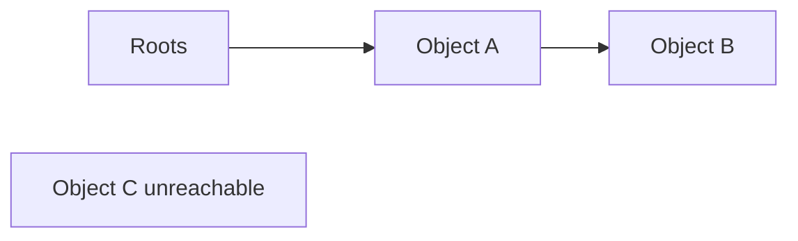

# 16 垃圾回收

## 本章解决什么问题

垃圾回收自动释放程序不再使用的堆对象。它属于运行时系统，但编译器必须提供足够信息，例如哪些寄存器和栈槽里保存的是指针。

PPT 重点：mark-and-sweep、reference counting、copying collection、compiler interface。  
弱化：generational、incremental 等书上有，但课件提示可能不作为考试重点。

## 什么是垃圾

直觉上，垃圾是“以后不会再用的对象”。但准确判断“以后不会再用”不可判定，因为这会涉及程序是否终止等问题。

实际 GC 使用保守近似：从 root set 出发不可达的堆对象一定可以回收。

```text
roots: registers, stack slots, globals
          |
          v
reachable heap objects = live
unreachable objects    = garbage
```

## Root Set

Root set 包含程序可直接访问的指针来源：

- 全局变量中的指针。
- 当前栈帧和调用栈中的指针。
- 寄存器中的指针。

问题：运行时怎么知道一个栈槽或寄存器里是整数还是指针？这就需要编译器提供 pointer map 或 descriptor。

## Mark-and-Sweep

两阶段：

1. Mark：从 roots 出发遍历对象图，标记可达对象。
2. Sweep：扫描堆，未标记对象加入 freelist，已标记对象清除 mark bit。



`A`、`B` 被标记，`C` 被回收。

优点：

- 不移动对象，对外部指针友好。
- 实现相对直接。

缺点：

- 可能产生碎片。
- sweep 要扫描堆。
- mark 可能需要显式栈，深图会占空间。

## Pointer Reversal

Mark 阶段 DFS 需要栈。Pointer reversal 的思想是临时反转对象中的指针，用堆对象自身记录回溯路径，从而减少额外栈空间。

它难点在于会临时改写对象图，所以实现和理解都较复杂。

## Reference Counting

每个对象维护引用计数：

- 新引用指向对象：计数加一。
- 引用离开对象：计数减一。
- 计数为零：对象不可达，立即回收。

优点：

- 回收分散发生，暂停时间小。
- 不需要完整遍历所有活对象。

缺点：

- 每次指针赋值都有维护开销。
- 不能回收循环垃圾。

循环例子：

```text
A -> B
B -> A
roots no longer point to A/B
```

`A`、`B` 计数都非零，但从 roots 不可达。

## Copying Collection

把堆分成 from-space 和 to-space。分配只在 from-space；GC 时把可达对象复制到 to-space，然后整块丢弃 from-space。

Cheney 算法用两个指针：

```text
to-space:
| copied scanned | copied unscanned | free |
                 ^scan              ^next
```

步骤：

1. roots 指向的对象复制到 to-space。
2. 旧对象留下 forwarding pointer。
3. scan 指针扫描已复制对象中的字段，发现新对象就复制。
4. scan 追上 next 时结束。

优点：

- 分配快，通常只是移动 next 指针。
- 回收后对象紧凑，减少碎片。
- 复制顺序有助于局部性。

缺点：

- 需要额外空间。
- 对象地址会变，必须更新所有指针。

## Compiler Interface

GC 需要编译器支持：

| 信息 | 用途 |
|---|---|
| pointer map | 告诉 GC 哪些栈槽/寄存器是指针 |
| type descriptor | 告诉 GC 对象内部哪些字段是指针 |
| allocation protocol | 快速分配和触发 GC |
| safe point | GC 可以安全检查 roots 的程序点 |

Derived pointer 是难点：指针可能指向对象内部，例如数组元素地址。移动对象时，GC 需要知道 base pointer，才能正确更新 derived pointer。

## 弱化内容速记

### Generational GC

基于经验：多数对象很快死亡。把堆分代，频繁收年轻代，较少收老年代。需要 remembered set 和 write barrier 记录老对象指向新对象的引用。

### Incremental GC

把 GC 工作拆成小步，减少长暂停。常用 tricolor abstraction：white、gray、black。需要维护不变量，防止程序修改对象图破坏标记过程。

## 常见误区

- “不可达”是 GC 可安全判断的垃圾，不等于理论上的“以后绝不会用”。
- Reference counting 中计数非零不代表从 root 可达。
- Copying GC 必须更新所有指针，否则会悬挂到 from-space。
- GC 不是只扫描堆，还必须从 roots 开始。
- 编译器如果不给 pointer map，精确 GC 很难安全工作。

## 练习

1. 给一张堆对象图，标出 mark-and-sweep 后哪些对象被回收。
2. 对一系列指针赋值，模拟 reference count 变化。
3. 构造一个 reference counting 无法回收的循环垃圾。
4. 用 Cheney 算法模拟 from-space 到 to-space 的复制过程。
5. 说明 pointer map 和 type descriptor 分别解决什么问题。

## 练习参考答案

见 [23_练习参考答案.md](23_练习参考答案.md) 中对应章节。

## 术语中英对照

| English | 中文 | 考试提示 |
|---|---|---|
| garbage collection, GC | 垃圾回收 | 自动回收不可达对象 |
| heap | 堆 | 动态分配区域 |
| root set | 根集合 | GC 遍历起点 |
| reachability | 可达性 | 从 roots 沿指针可达 |
| live object | 活对象 | 可达对象 |
| mark-and-sweep | 标记-清扫 | mark live, sweep garbage |
| mark bit | 标记位 | 记录是否可达 |
| freelist | 空闲链表 | 可重新分配的块 |
| pointer reversal | 指针反转 | 用对象字段模拟 DFS 栈 |
| reference counting | 引用计数 | 计数为零立即回收 |
| cycle | 环 | RC 难以回收 |
| copying collection | 复制式回收 | from-space -> to-space |
| forwarding pointer | 转发指针 | 旧对象指向新地址 |
| Cheney algorithm | Cheney 算法 | BFS copying GC |
| pointer map | 指针映射 | 栈/寄存器哪些是指针 |
| type descriptor | 类型描述符 | 对象字段布局 |
| safe point | 安全点 | 可安全 GC 的程序点 |
| write barrier | 写屏障 | 分代/增量 GC 维护信息 |

